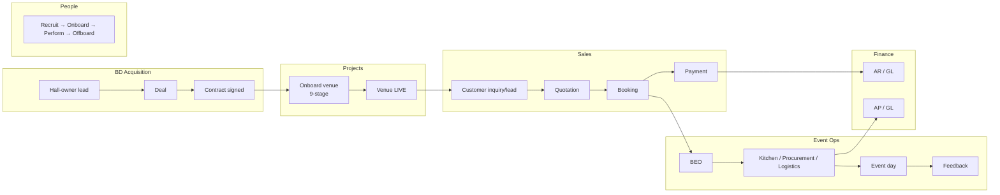
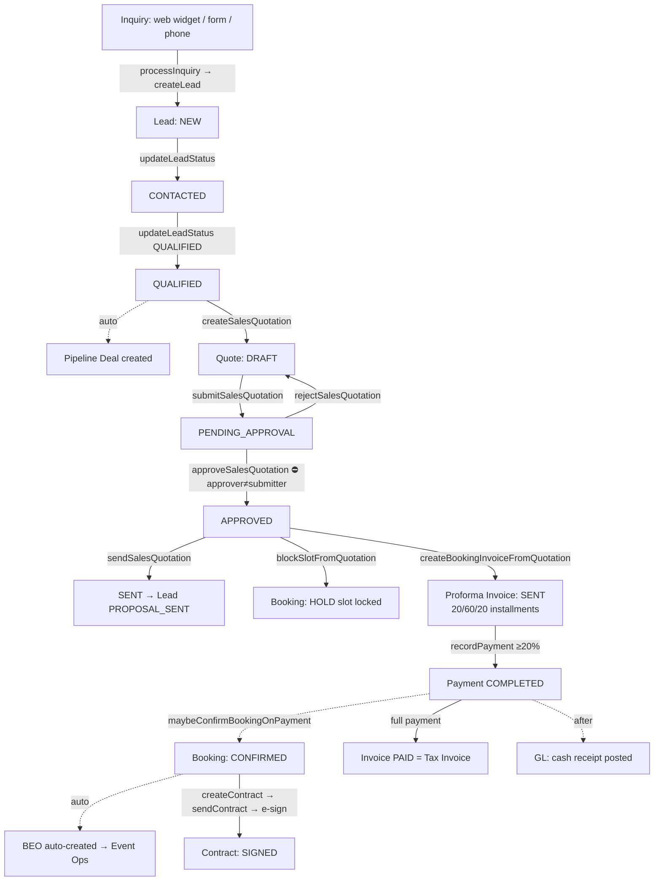
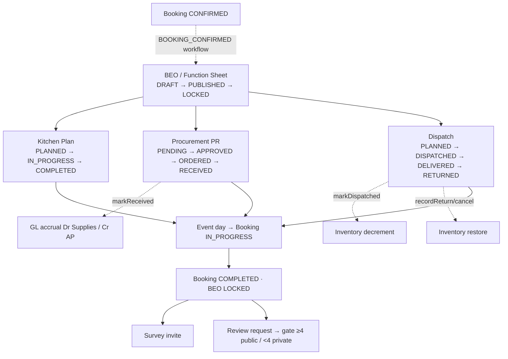
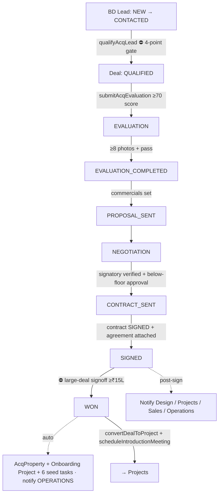
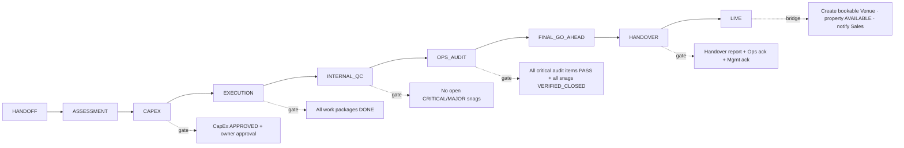
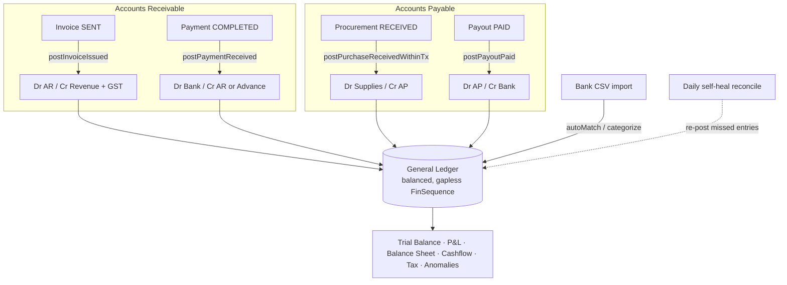
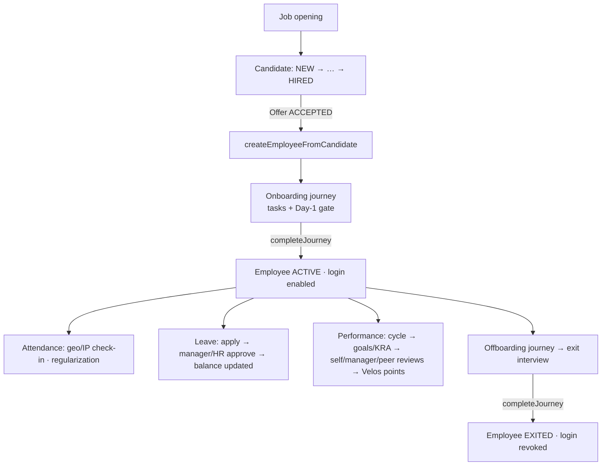

# VeloriaApp — Business Process Map

_End-to-end operational process map of the team-side ERP, reconstructed from the actual code (server actions, Prisma enums, RBAC, cron/automation). Each process lists its real status values, the action that drives each transition, who can do it, the system side-effects, and the handoffs between processes._

Diagrams are written in **Mermaid** (renders on GitHub and most markdown viewers).

---

## 0. The value chain (how the processes connect)

**Two revenue spines:** BD **acquires** venues → Projects **readies** them → they go **LIVE** and feed the Sales pipeline → Sales books events → Event Ops **delivers** them → Finance **records** the money. HR/People staffs all of it.

---

## 1. Sales process (customer journey)

**Owner roles:** SALES_EXEC, SALES_HEAD · **Source actions:** `lead.actions`, `widget.actions`, `sales-quotation.actions`, `quotation-booking.actions`, `booking-invoice.actions`, `payment.actions`, `contract.actions`.

**Status enums (real):**
- **Lead:** `NEW → CONTACTED → QUALIFIED → PROPOSAL_SENT → NEGOTIATION → WON | LOST`
- **Quotation:** `DRAFT → PENDING_APPROVAL → APPROVED → SENT | REJECTED(→DRAFT)`
- **Booking:** `HOLD → TENTATIVE → CONFIRMED → IN_PROGRESS → COMPLETED | CANCELLED`
- **Invoice:** `DRAFT → SENT → PARTIALLY_PAID → PAID | OVERDUE | CANCELLED`
- **Payment:** `PENDING → COMPLETED | FAILED | REFUNDED`
- **Contract:** `DRAFT → SENT → VIEWED → SIGNED | EXPIRED | CANCELLED`

**Key gates & automations:**
- Lead → QUALIFIED **auto-creates a pipeline Deal**; WON requires an assigned owner.
- Quote approval enforces **segregation of duties** (approver ≠ submitter, except SUPER_ADMIN) and **freezes a pricing snapshot** for the PDF.
- Proforma is a **20% / 60% / 20%** installment plan (advance now / 15 days before / 2 h before event).
- A **20%+ payment auto-confirms** the booking, which **auto-creates the BEO** (→ Event Ops) and spawns SOP tasks.
- Slot is locked by a unique (venue, UTC-day, time-slot) constraint → no double-booking.

---

## 2. Event Operations process (delivery)

**Owner roles:** EVENT_COORDINATOR, OPERATIONS + module teams · **Actions:** `beo.actions`, `kitchen.actions`, `procurement.actions`, `logistics.actions`, `survey.actions`, `public-feedback.actions`.

**Status enums:** BEO `DRAFT→PUBLISHED→LOCKED`; Kitchen `PLANNED→IN_PROGRESS→COMPLETED`; Procurement `PENDING→APPROVED→ORDERED→RECEIVED|REJECTED`; Dispatch `PLANNED→DISPATCHED→DELIVERED→RETURNED|CANCELLED`; Review `PENDING→SENT→RATED→ROUTED_PUBLIC|ROUTED_PRIVATE→COMPLETED`.

**Bridges & gates:**
- **Booking CONFIRMED → BEO** auto-created (idempotent); SOP task templates for all 12 event types.
- **Procurement RECEIVED → GL** accrual (Dr 5230 Supplies / Cr 2010 AP), idempotent + self-healing.
- **Dispatch → Inventory:** atomic decrement on dispatch, atomic restore on return/cancel (can't go negative).
- **Procurement approval = maker-checker** (requester ≠ approver).
- Post-event **feedback gate:** ≥4★ routes to a public Google-review link; <4★ is captured privately for staff follow-up.

---

## 3. BD / Acquisition process (winning new venues)

**Owner roles:** BD_EXECUTIVE, BD_HEAD, LEGAL · **Actions:** `acq-lead.actions`, `acq-deal.actions`, `acq-contract.actions`, `acq-meeting.actions`.

**Deal stage enum:** `QUALIFIED → EVALUATION → EVALUATION_COMPLETED → PROPOSAL_SENT → NEGOTIATION → CONTRACT_SENT → SIGNED → WON | LOST | ON_HOLD`.
**Contract lifecycle:** phases `AUTHORING→APPROVAL→NEGOTIATION→EXECUTION→POST_EXECUTION`; status `DRAFT→APPROVED→NEGOTIATED→SIGNED→ACTIVE→TERMINATED`.

**Approval gates:** qualification 4-point checklist; evaluation scorecard ≥70 + key fields ≥3; below-floor commercial → BD-Head approval (≠ owner); economics-freeze re-approval; **large-deal (≥₹15L) second sign-off**; signature evidence (e-sign or attached agreement) before SIGNED. **WON** auto-creates the property + onboarding project and notifies Operations; post-sign notifies all four delivery teams; **intro meetings** align Design/Projects/Sales/Operations.

---

## 4. Projects process (venue onboarding — 9 stages)

**Owner roles:** PROJECTS_EXEC, PROJECTS_HEAD, OPERATIONS · **Actions:** `projects.actions`, `project-procurement.actions`, `snags.actions`.

**Phase enum:** `HANDOFF → ASSESSMENT → CAPEX → EXECUTION → INTERNAL_QC → OPS_AUDIT → FINAL_GO_AHEAD → HANDOVER → LIVE`.
**Sub-flows:** CapEx projection (`DRAFT→PENDING_APPROVAL→APPROVED→SENT`), Work Packages (`PLANNED→IN_PROGRESS→DONE`), Purchase Orders (`DRAFT→ISSUED→RECEIVED→PAID`), Snags (`OPEN→IN_PROGRESS→FIXED_PENDING_VERIFICATION→VERIFIED_CLOSED|REOPENED`, severity CRITICAL/MAJOR/MINOR).

**Gates:** each stage advance is sign-off-recorded + audit-logged; QC blocks on open critical/major snags; Ops audit needs all critical items PASS and all snags verified-closed; **dual acknowledgement** (Ops + Mgmt) before LIVE. **LIVE atomically creates the bookable Venue** (BD→Bookings bridge) and notifies Sales to start generating bookings. Backward `reopenProject` clears later-stage stamps (cannot reopen LIVE).

---

## 5. Finance process (the money)

**Owner roles:** FINANCE, ADMIN · **Core:** `src/lib/finance/*` (double-entry GL), `payment.actions`, `payout.actions`, `commission.actions`, `finance-bank.actions`.

**Status enums:** Invoice (as above); Payout `PENDING→APPROVED→PAID|CANCELLED`; Commission `PENDING→APPROVED→PAID`; Journal entry `DRAFT→POSTED|REVERSED`; Bank txn `UNMATCHED→MATCHED|RECONCILED|IGNORED`.

**Controls:** integer-paise math (no float drift); **idempotent GL posting** keyed by (sourceModule, sourceRefId) → one journal entry per source doc; **daily self-healing reconcile** re-posts anything missed; **duplicate-payment control** (same vendor+amount+type within 7 days blocks); **maker-checker** on payout approval; period locking; gapless FinSequence numbering; balance invariant (Σ debits = Σ credits). Every upstream module (Sales, Procurement, Payables, Bank, Payroll) bridges into the GL.

---

## 6. HR / People process (employee lifecycle)

**Owner roles:** HR_MANAGER, HR_EXECUTIVE + reporting managers · **Actions:** `recruit*.actions`, `hr-employee.actions`, `hr-journey.actions`, `hr-leave.actions`, `hr-attendance.actions`, `hr-performance.actions`.

**Status enums:** Candidate `NEW→IN_REVIEW→AVAILABLE→ENGAGED→OFFERED→HIRED|REJECTED`; Offer `DRAFT→SENT→ACCEPTED|DECLINED|WITHDRAWN`; Journey `IN_PROGRESS→COMPLETED|CANCELLED`; Leave request `PENDING→APPROVED|REJECTED|CANCELLED`; Attendance `PRESENT|ABSENT|HALF_DAY|WFH|ON_LEAVE|…`; Appraisal cycle `DRAFT→ACTIVE→CLOSED`.

**Approval routing:** leave & regularization route **up the org chart** to the reporting manager (HR override available); **onboarding completion → activates platform login**; **offboarding completion → revokes login** + stamps exit date; performance flows feed **KRA scorecards + Velos points** (gamified incentives).

---

## Cross-cutting: RBAC, automation, audit

- **RBAC:** two systems — global `hasPermission(role, "x:read|write")` (see `src/lib/permissions.ts`) and the BD-specific `acqCan` (`src/lib/acq/rbac.ts`). Routes gated in `middleware.ts`. **VeloriaApp is a single-company ERP — staff-wide visibility within a permission is intentional, not a leak.**
- **Automation:** two cron lanes — `frequent` (SLA escalation, payment reminders, BD SLA) and `daily` (digests, GL self-heal reconcile, event auto-completion). On Vercel Hobby these run **daily**; an external scheduler can restore hourly.
- **Audit:** append-only activity/audit logs across modules; project sign-offs; finance journal entries are immutable (reversed, never deleted).

---

_This map reflects the code as deployed. For the security/correctness posture of these flows, see `docs/TEAM_AUDIT.md`._
