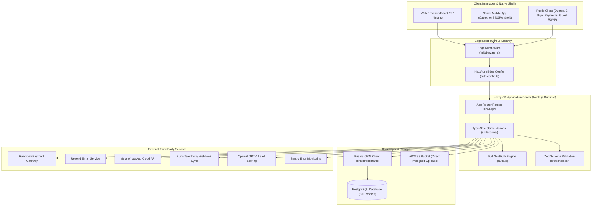

# CHUNK 01-01 — SYSTEM OVERVIEW

- **Status**: `CODE VERIFIED` | `BRIEF DOCUMENTED`
- **Module**: System Architecture
- **Target Path**: `knowledge-base/01-system-architecture/01-system-overview.md`

---

## 📌 Executive Summary

**Veloria Grand** is an end-to-end venue management, sales CRM, event execution, and financial accounting automation platform built for luxury wedding venues, banquet halls, and multi-purpose event spaces.

The platform orchestrates the complete lifecycle of venue operations:
1. **Commercial Acquisition & Lead Generation**: Google/FB Ads lead capture, website widget, AI lead scoring, and automated sales rep allocation.
2. **Quotation & Digital Contracts**: Dynamic peak/saava package pricing, interactive public quotation links, and tokenized e-signatures.
3. **Calendar & Space Allocation**: Seating blackout dates, slot locks, multi-hall allocation, and public slot hold management.
4. **BEO & Event Execution**: Banquet Event Order (BEO) generation, sales-to-ops handover SLAs, Blueprint task execution, kitchen prep aggregation, and vendor bidding.
5. **Billing & General Ledger**: Tax invoicing (CGST/SGST/IGST), Razorpay payment link checkout, automated webhook reconciliation, double-entry General Ledger (GL), and vendor payouts.
6. **People & HR Systems**: Geo-fenced biometric attendance clock-in, leave approval cascade, monthly statutory payroll (PF, ESI, PT), expense claim reviews, and recruitment ATS.
7. **Portals & Native Mobile Apps**: Client Portal (`src/app/(portal)`), Vendor Portal (`src/app/(vendor-portal)`), Guest App (`src/app/(guest)`), and Capacitor 8 iOS/Android native app.

---

## 🏗️ High-Level System Architecture Diagram

---

## 🔬 Core Subsystems Matrix

| Subsystem | Responsibilities | Primary Code Directories | Database Models |
|---|---|---|---|
| **Identity & Access** | Authentication, 2FA, Biometrics, RBAC | `auth.ts`, `middleware.ts`, `src/lib/permissions.ts` | `User`, `Account`, `Session`, `ApiKey` |
| **Sales CRM** | Lead capture, AI scoring, Round-robin | `src/app/(dashboard)/leads/`, `src/actions/lead.actions.ts` | `Lead`, `Contact`, `WidgetInquiry` |
| **Quotations & Pricing** | Yield pricing matrix, Package catalog | `src/app/(dashboard)/quotations/`, `src/actions/pricing.actions.ts` | `SalesQuotation`, `PricingRule`, `QuoteLineItem` |
| **Bookings & Calendar** | Space availability, Slot holds, RSVPs | `src/app/(dashboard)/bookings/`, `src/actions/booking.actions.ts` | `Booking`, `Venue`, `BlackoutDate`, `SlotHold` |
| **BEO & Operations** | Handover SLA, Blueprint engine, Tasks | `src/app/(dashboard)/beo/`, `src/lib/blueprints/` | `HandoverMeeting`, `ExecutionTask`, `TimelineItem` |
| **Kitchen & Inventory** | Dish prep lists, Stock deduction | `src/app/(dashboard)/kitchen/`, `src/actions/kitchen.actions.ts` | `InventoryItem`, `RecipeComponent` |
| **Vendors & POs** | Vendor portal, Work package bidding | `src/app/(dashboard)/vendors/`, `src/actions/vendor.actions.ts` | `Vendor`, `VendorBid`, `PurchaseOrder` |
| **Invoicing & Payments** | GST invoices, Razorpay online links | `src/app/(dashboard)/invoices/`, `src/actions/payment.actions.ts` | `Invoice`, `Payment`, `PaymentLink` |
| **Finance GL** | Double-entry ledger, Payouts, RevShare | `src/app/(dashboard)/finance/`, `src/actions/finance.actions.ts` | `FinJournalEntry`, `FinAccount`, `Payout` |
| **HR & Payroll** | Attendance, Leave, Salary sheet, Claims | `src/app/(dashboard)/people/`, `src/actions/hr-payroll.actions.ts` | `Employee`, `AttendanceRecord`, `PayrollEntry` |
| **Mobile Shell** | Capacitor 8 iOS/Android native integration | `capacitor.config.ts`, `android/`, `ios/` | `PushSubscription` |
