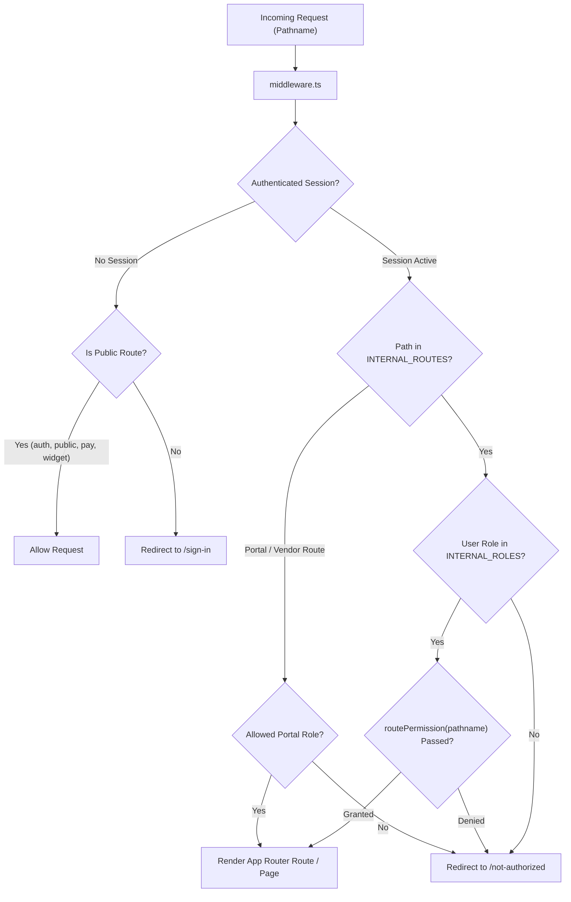

# CHUNK 01-04 — NEXT.JS APPLICATION TOPOLOGY

- **Status**: `CODE VERIFIED`
- **Module**: System Architecture
- **Target Path**: `knowledge-base/01-system-architecture/04-nextjs-application-topology.md`

---

## 📌 App Router Layout & Route Group Architecture

Veloria Grand uses the **Next.js 16 App Router** pattern with **Route Groups** (`(groupName)`) to isolate layouts, styling themes, and access control policies without altering URL paths.

```
src/app/
├── (auth)/             # Auth group (Sign-in, 2FA, Password Reset) -> Isolated Auth Layout
├── (dashboard)/        # Internal Staff CRM & Ops (395 routes) -> Protected Sidebar & Header Layout
├── (portal)/           # Client Portal (17 routes) -> Client Portal Shell Layout
├── (vendor-portal)/    # Vendor Workstation (4 routes) -> Vendor Portal Shell Layout
├── (guest)/            # Guest RSVP & App (28 routes) -> Mobile-Optimized Guest Layout
├── (public)/           # Public Tokenized Pages (21 routes) -> Unauthenticated Clean View Layout
├── (print)/            # Invoice Print Layouts -> PDF / Print CSS Optimized Layout
├── api/                # API Endpoints (111 routes: 56 Cron, 7 Webhooks, REST APIs)
├── pay/                # Public Razorpay Checkout -> Secure Payment Form Layout
├── onboard/            # Self-serve Onboarding Forms -> Wizard Form Layout
└── widget/             # Embeddable Website Widget -> CORS-enabled iframe Layout
```

---

## 🛡️ Route Access Control & Middleware Resolution

All incoming requests are intercepted by `middleware.ts` before reaching route handlers or Server Components:



---

## 🎨 Rendering Strategy: RSC vs RCC

- **React Server Components (RSC)**: Default for all `page.tsx` files. Server components query PostgreSQL directly using Prisma (`prisma.lead.findMany()`) with **0 KB client JavaScript bundle overhead**.
- **React Client Components (RCC)**: Demarcated by `"use client"` at file headers. Reserved strictly for interactive UI elements:
  - Form state management (`react-hook-form` + `zodResolver`)
  - Interactive charts (`recharts`)
  - Drag-and-drop Kanban pipeline boards (`@dnd-kit/core`)
  - Dialog modals, dropdowns, and toast notifications (`sonner`)
