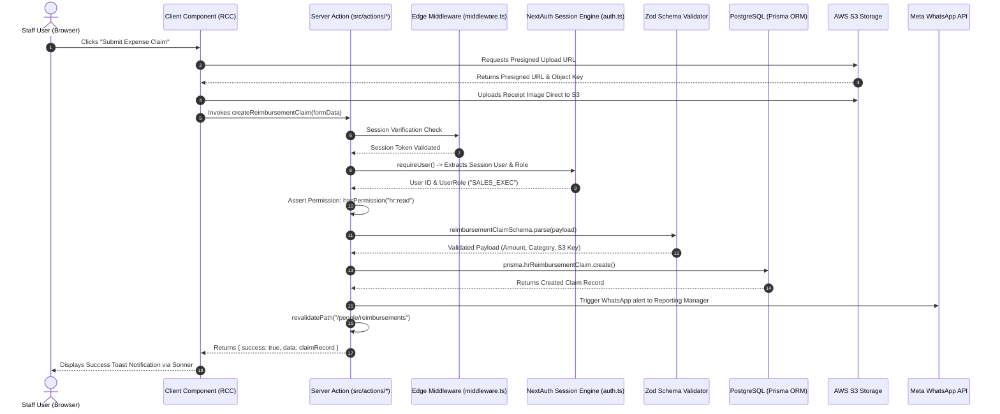
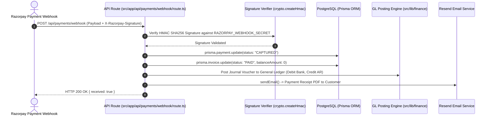

# CHUNK 01-05 — REQUEST / RESPONSE ARCHITECTURE

- **Status**: `CODE VERIFIED`
- **Module**: System Architecture
- **Target Path**: `knowledge-base/01-system-architecture/05-request-response-architecture.md`

---

## 📌 Interactive Request-Response Lifecycle

Below is the complete end-to-end trace of a user interaction in Veloria Grand, moving from browser user input down to server-side action processing, database mutation, external integration, and cache revalidation.

---

## 🌐 API & Webhook Request Lifecycle

