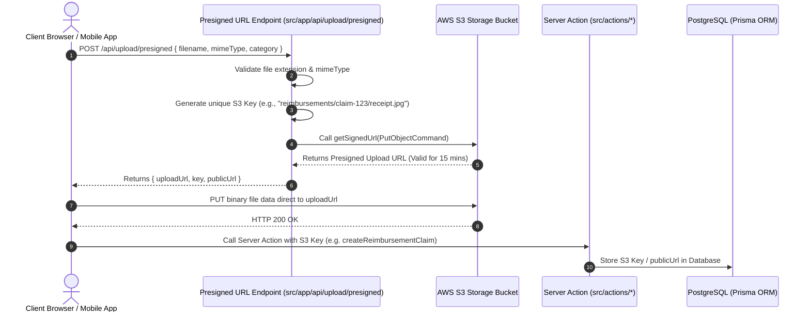

# CHUNK 01-12 — FILE STORAGE ARCHITECTURE

- **Status**: `CODE VERIFIED` | `BRIEF DOCUMENTED`
- **Module**: System Architecture
- **Target Path**: `knowledge-base/01-system-architecture/12-file-storage-architecture.md`

---

## 📌 AWS S3 Presigned URL Direct Upload Architecture

Veloria Grand uses **AWS S3** via `@aws-sdk/s3-request-presigner` (`src/lib/storage/s3.ts`) for direct client-to-storage uploads.

> [!NOTE]
> **Resolution of Brief Trap 3**: Legacy inline base64 uploads failed on files > 4.5 MB due to Next.js server payload body limits. Presigned URLs bypass the application server completely for file uploads.

---

## 🔍 Tracing 3 Production Upload Flows

1. **Reimbursement Receipt Upload**: Expense claim receipts uploaded to `reimbursements/{employeeId}/{timestamp}_{filename}`.
2. **Signed Contract Document**: Digital e-signed contract PDFs saved to `contracts/{bookingId}/contract_{timestamp}.pdf`.
3. **Venue Gallery & Photo Upload**: High-resolution venue space images stored in `venues/{venueId}/gallery/{filename}`.
