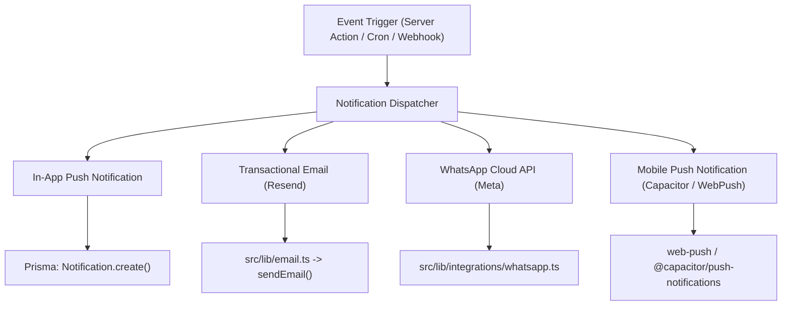

# CHUNK 01-15 — NOTIFICATION ARCHITECTURE

- **Status**: `CODE VERIFIED`
- **Module**: System Architecture
- **Target Path**: `knowledge-base/01-system-architecture/15-notification-architecture.md`

---

## 🔔 Multi-Channel Notification Architecture

Veloria Grand routes notifications through **4 distinct delivery channels**:

### Channel Details
1. **In-App Notifications**: Stored in `Notification` model in PostgreSQL. Displays real-time alerts in the top navigation bell dropdown (`src/app/(dashboard)/notifications/page.tsx`).
2. **Transactional Email (`src/lib/email.ts`)**: Powered by Resend. Sends styled HTML emails for quotation proposals, invoice PDFs, contract e-signature requests, and password reset links.
3. **WhatsApp Cloud API (`src/lib/integrations/whatsapp.ts`)**: Direct Meta API integration dispatching templated messages for lead assignment alerts, quote nudges, and payment reminders.
4. **Native Mobile Push**: Integrates `@capacitor/push-notifications` and `web-push` for instant mobile alerts on Android and iOS devices.
