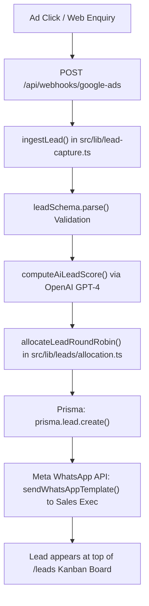
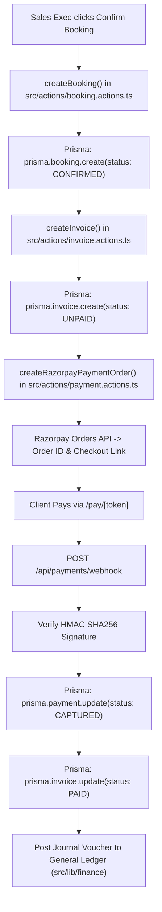

# CHUNK 01-20 — END-TO-END SYSTEM FLOWS

- **Status**: `CODE VERIFIED`
- **Module**: System Architecture
- **Target Path**: `knowledge-base/01-system-architecture/20-end-to-end-system-flows.md`

---

## 🔄 Flow 01: Inbound Lead Capture → AI Score → Round-Robin → WhatsApp Alert

---

## 🔄 Flow 02: Booking Confirmation → Invoice → Razorpay → Ledger

