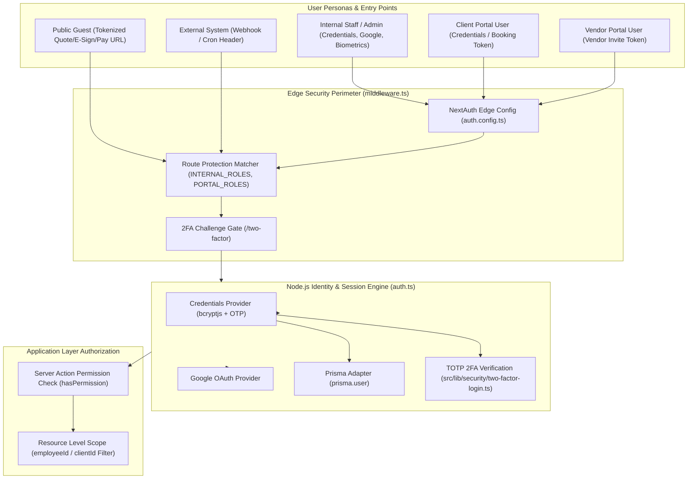

# CHUNK 02-01 — AUTHENTICATION OVERVIEW

- **Status**: `CODE VERIFIED` | `BRIEF DOCUMENTED`
- **Module**: Authentication & Security
- **Target Path**: `knowledge-base/02-authentication-security/01-authentication-overview.md`

---

## 📌 Authentication Architecture Overview

**Veloria Grand** enforces a multi-tier authentication and authorization security framework tailored to distinct user roles and entry points:

1. **Internal Staff & Management**: Password credentials (with `bcryptjs` hashing) and Google OAuth (`auth.ts`), protected by 2FA TOTP enforcement (`src/lib/security/two-factor-policy.ts`). Native mobile staff utilize Capacitor biometric hardware authentication (`src/lib/capacitor/biometric.ts`).
2. **Client Portal Users (`CLIENT`)**: Authenticate via tokenized booking links or client credentials to access `/portal/*` (`src/lib/guest-session.ts`).
3. **Vendor Portal Users (`VENDOR`)**: Authenticate via vendor portal invites and credentials to access `/vendor-portal/*`.
4. **Public & Guest Users**: Unauthenticated or tokenized URL access (`/public/q/[quoteToken]`, `/public/sign/[contractToken]`, `/pay/[token]`).
5. **System & Integration APIs**: Secure Bearer tokens (`CRON_SECRET`), API Keys (`ApiKey` model), and HMAC SHA256 signatures (`X-Razorpay-Signature`, `X-Hub-Signature`).

---

## 🏗️ High-Level Security Architecture Diagram

---

## 🔒 Authentication vs Authorization Boundaries

- **AUTHENTICATION (Who are you?)**: Verified by NextAuth (`auth.ts`), checking hashed passwords (`bcryptjs`), OTP codes (`src/lib/otp.ts`), TOTP codes (`src/lib/security/two-factor-login.ts`), or Google OAuth assertions. Establishes the `session.user` object (`id`, `email`, `role`, `twoFactorVerified`).
- **AUTHORIZATION (What are you allowed to do?)**: Evaluated at two levels:
  1. **Role-Based Access Control (RBAC)**: `hasPermission(role, permission)` in `src/lib/permissions.ts` and `middleware.ts`.
  2. **Resource-Level Scope**: Data filtering in Prisma queries (e.g. `where: { employeeId: session.user.id }` or `where: { clientId: session.user.id }`).
