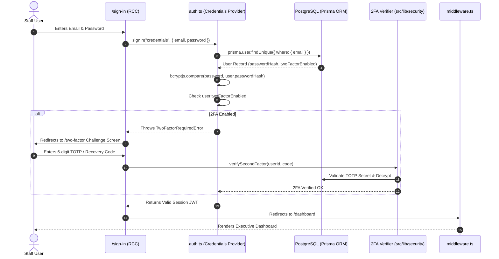
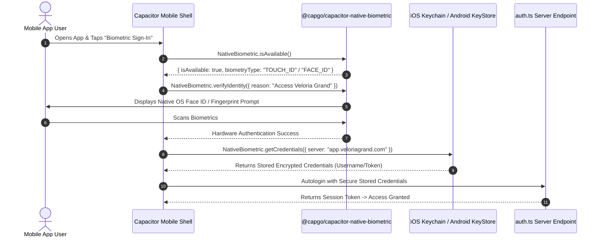

# CHUNK 02-04 — LOGIN FLOWS

- **Status**: `CODE VERIFIED`
- **Module**: Authentication & Security
- **Target Path**: `knowledge-base/02-authentication-security/04-login-flows.md`

---

## 🚪 Verified Authentication Sequences

### Flow 1: Staff Credentials Login + 2FA Challenge

---

## 📱 Mobile Biometric Native Authentication Flow (`src/lib/capacitor/biometric.ts`)

