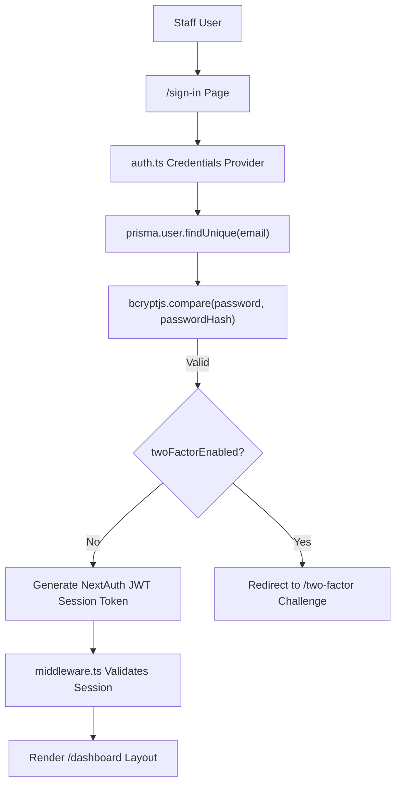
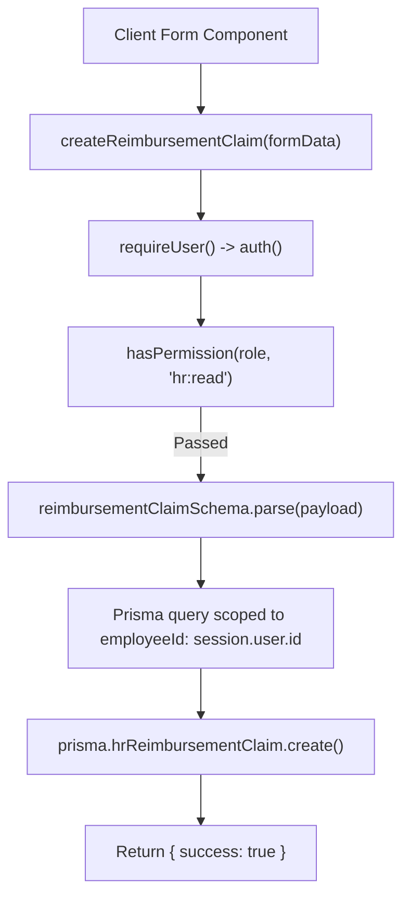

# CHUNK 02-20 — AUTHENTICATION END-TO-END FLOWS

- **Status**: `CODE VERIFIED`
- **Module**: Authentication & Security
- **Target Path**: `knowledge-base/02-authentication-security/20-authentication-end-to-end-flows.md`

---

## 🔄 Flow 01: Internal Staff Credentials Login

---

## 🔄 Flow 02: Protected Server Action & Resource Scope Check

