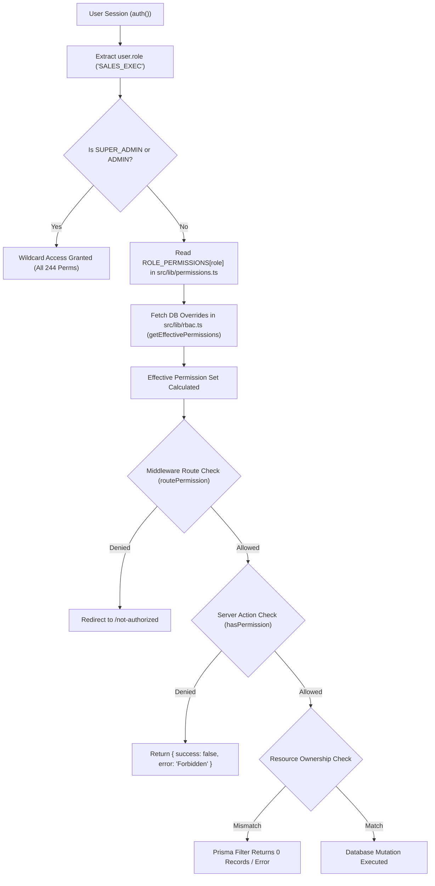

# CHUNK 03-01 — RBAC OVERVIEW & ARCHITECTURE

- **Status**: `CODE VERIFIED` | `BRIEF DOCUMENTED`
- **Module**: Roles & RBAC System
- **Target Path**: `knowledge-base/03-user-roles-permissions/01-rbac-overview.md`

---

## 📌 Role-Based Access Control Architecture Overview

Veloria Grand enforces a multi-layered Role-Based Access Control (RBAC) architecture that maps authenticated users to **23 distinct User Roles** (`UserRole` Enum) and **244 Granular Permission Keys** (`src/lib/permissions.ts`).

### Key Dimensions of Veloria RBAC

1. **Static Role Defaults**: Every role has a baseline array of granted permissions defined in `ROLE_PERMISSIONS` inside `src/lib/permissions.ts`.
2. **Dynamic Database Overrides (`src/lib/rbac.ts`)**: For 15 editable roles (`EDITABLE_ROLES`), administrators can grant or revoke individual permission keys per user/role stored in the database (`getEffectivePermissions(userId, role)`).
3. **Super Admin & Admin Wildcard Bypass**: `SUPER_ADMIN` and `ADMIN` automatically pass all permission checks (`hasPermission()`) across the system.
4. **Edge Route Protection (`middleware.ts`)**: Fast Edge-level route protection checking `INTERNAL_ROLES`, `PORTAL_ROLES`, `VENDOR_PORTAL_ROLES`, and `routePermission(pathname)`.
5. **Server Action Assertions**: Every Server Action (`src/actions/*`) asserts session validity via `requireUser()` and permission keys via `hasPermission(role, permission)`.
6. **Resource Ownership Isolation**: Beyond role capabilities, Prisma queries filter records by entity ownership (`employeeId`, `clientId`, `vendorId`, `assignedRepId`).

---

## 🏗️ RBAC Architecture Flowchart

