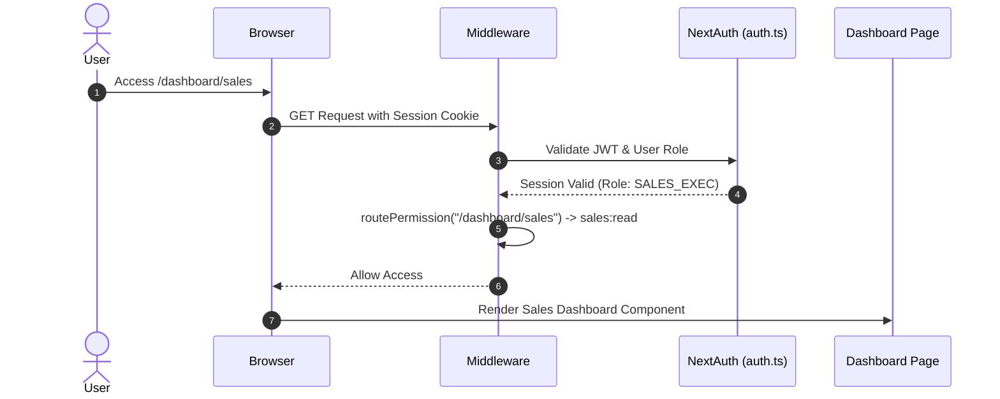
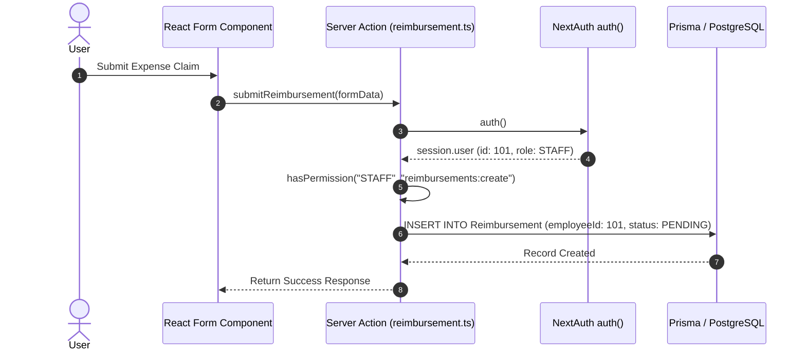
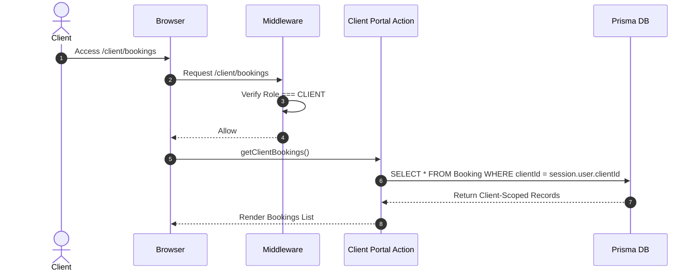

# RBAC End-to-End Sequence Flows

## Overview

Mermaid sequence diagrams demonstrating end-to-end authorization flows across key system interactions.

---

## Flow 1: Internal User Authentication & Route Access

---

## Flow 2: Server Action Authorization & DB Execution

---

## Flow 3: External Client Portal Isolation Flow

