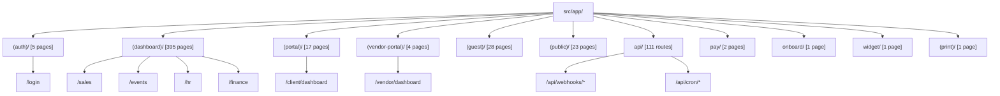

# Route Group Topology

## Overview

Veloria Grand structures its App Router filesystem using Next.js Route Groups to segregate layouts, authentication boundaries, and tenant experiences.

---

## App Router Directory Map

---

## Topology Summary Table

| Route Group | Base URL Path | Isolated Layout File | Primary Role Scope |
|---|---|---|---|
| `(auth)` | `/login`, `/register` | `src/app/(auth)/layout.tsx` | Unauthenticated / Guests |
| `(dashboard)` | `/dashboard`, `/sales`, `/hr`, etc. | `src/app/(dashboard)/layout.tsx` | Internal Staff & Admin Roles |
| `(portal)` | `/client/*` | `src/app/(portal)/layout.tsx` | `CLIENT` Role |
| `(vendor-portal)` | `/vendor/*` | `src/app/(vendor-portal)/layout.tsx` | `VENDOR` Role |
| `(guest)` | `/guest/*`, `/event-guest/*` | `src/app/(guest)/layout.tsx` | Event Guests & Public Attendees |
| `(public)` | `/events`, `/about`, `/contact` | `src/app/(public)/layout.tsx` | Unauthenticated Public |
| `api` | `/api/*` | N/A (Route Handlers) | Mixed (Session / Secret / Signature) |
