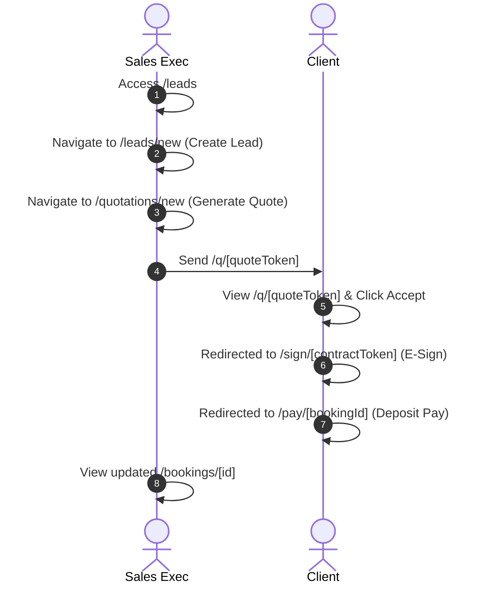
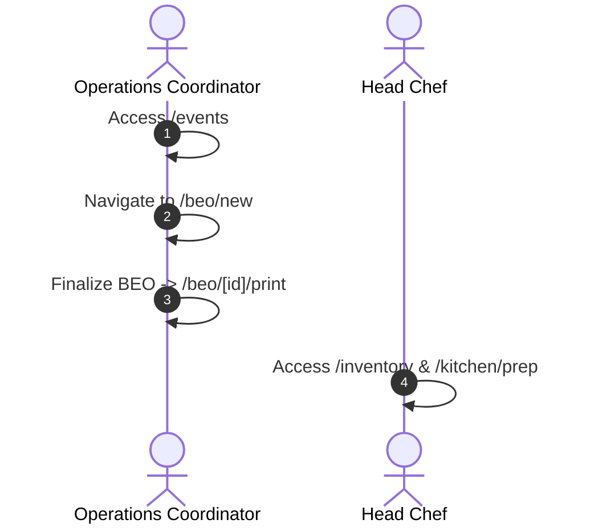

# User Navigation Journeys

## Overview

Key end-to-end user navigation flows across application routes.

---

## Journey 1: Lead to Booking & Contract Execution

---

## Journey 2: BEO & Kitchen Operations Execution

