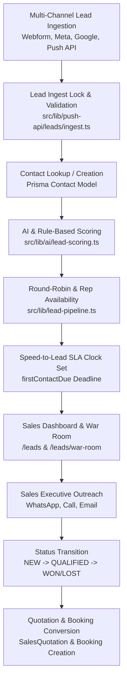

# Lead CRM Architecture Overview

## Overview

The Lead CRM module in Veloria Grand provides an end-to-end lead lifecycle management engine, spanning multi-channel ingestion, automated AI scoring, SLA clock tracking, round-robin assignment, status state transitions, quotation conversion, and re-engagement winback routines.

---

## Technical Pipeline & Flow Architecture

---

## Implementation Evidence Summary

| Component / Layer | Primary File / Code Reference | Status |
|---|---|---|
| Ingestion & Webhooks | `src/app/api/webhooks/facebook-leads/route.ts`, `src/app/api/v1/push/leads/route.ts` | CODE VERIFIED |
| Database Models | `Lead`, `Contact`, `LeadCaptureConfig`, `LeadRoutingDecision`, `AcqLead` | CODE VERIFIED |
| Server Actions | `src/actions/lead.actions.ts`, `src/actions/cooling-lead.actions.ts` | CODE VERIFIED |
| AI Scoring Engine | `src/lib/ai/lead-scoring.ts`, `src/lib/lead-scoring.ts` | CODE VERIFIED |
| SLA & Speed to Lead | `src/actions/speed-to-lead.actions.ts`, `/leads/sla` | CODE VERIFIED |
