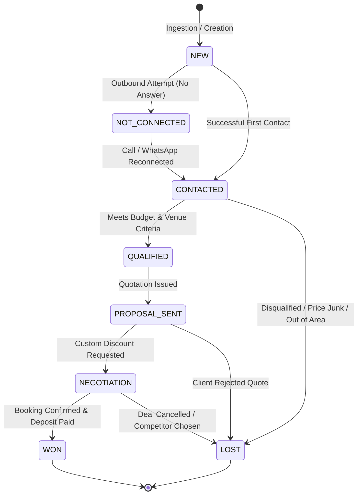

# Lead Status Lifecycle & State Machine

## Overview

Veloria Grand enforces a strict lead lifecycle state machine defined by the `LeadStatus` enum in Prisma.

---

## State Transition Map

---

## Enforced Status Definitions

| Status Value | Meaning | Action Trigger | Terminal State? |
|---|---|---|---|
| `NEW` | Freshly ingested lead; uncontacted | SLA clock active | No |
| `NOT_CONNECTED` | Attempted call/message; no client response | Retries scheduled | No |
| `CONTACTED` | Two-way communication established | Requirements gathering | No |
| `QUALIFIED` | Lead verified as genuine inquiry meeting thresholds | Site visit / Quote creation | No |
| `PROPOSAL_SENT` | Official `SalesQuotation` sent to client | Follow-up timer | No |
| `NEGOTIATION` | Discount or custom terms under review | Manager approval | No |
| `WON` | Event booking finalized and deposit logged | Triggers Booking creation | Yes |
| `LOST` | Inquiry abandoned, rejected, or junked | Triggers `lostReason` requirement | Yes |
