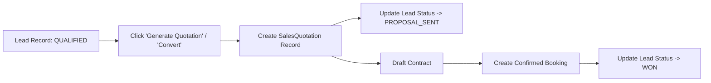

# Lead Conversion Architecture

## Overview

Lead conversion transitions a qualified inquiry into active sales transactions (Quotations, Deals, and Event Bookings).

---

## Conversion Workflow

---

## Created & Updated Entities

- **`SalesQuotation`**: Created with line items copied from lead requirements.
- **`Deal`**: Created to track financial pipeline value.
- **`Lead.status`**: Updated to `PROPOSAL_SENT` then `WON`.
