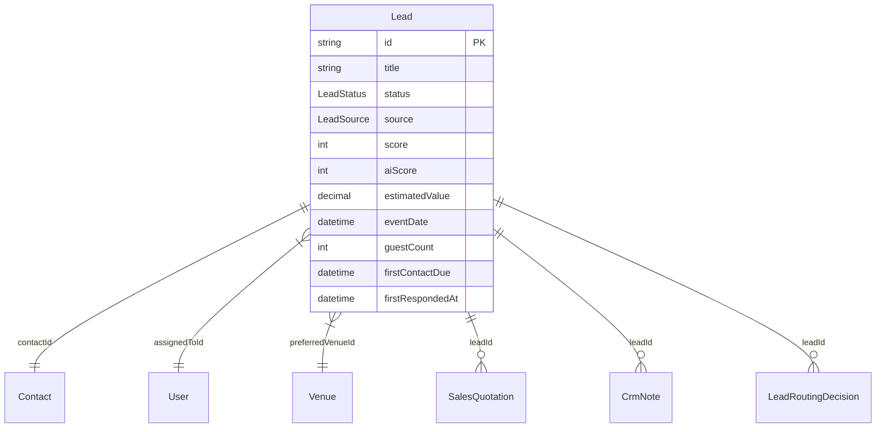

# Lead Database Schema & Entity Relationships

## Overview

Comprehensive reference for the `Lead` Prisma model and its primary relational entities.

---

## Schema Diagram

---

## Core Prisma Fields

- `id`: String cuid (@id)
- `title`: String
- `status`: `LeadStatus` enum (`NEW`, `QUALIFIED`, `WON`, `LOST`, etc.)
- `source`: `LeadSource` enum (`WEBSITE`, `FACEBOOK_ADS`, `WHATSAPP`, etc.)
- `score` / `aiScore`: Integer lead quality scores.
- `assignedToId`: Optional foreign key to `User`.
- `contactId`: Required foreign key to `Contact`.
