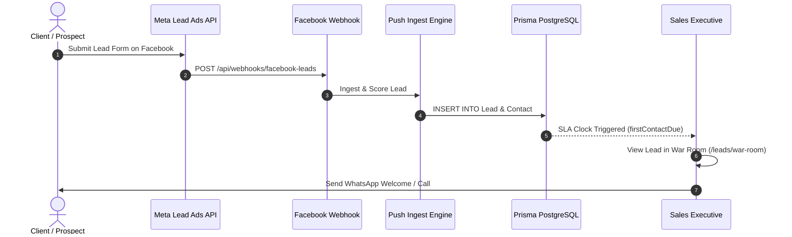
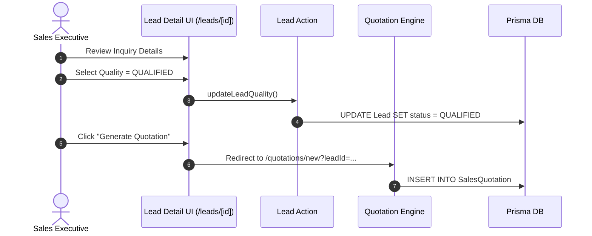

# Lead End-to-End User Journeys

## Overview

Sequence diagrams illustrating end-to-end user navigation and data execution for lead management workflows.

---

## Journey 1: Meta Lead Ad Ingestion to Executive Contact

---

## Journey 2: Lead Qualification & Quotation Conversion

