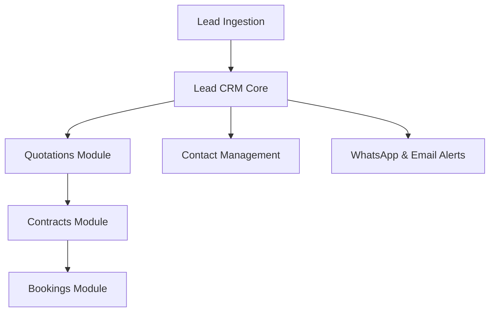

# Lead Feature Dependency Map

## Overview

Maps upstream and downstream module dependencies connected to Lead CRM.

---

## Dependency Graph

---

## Upstream & Downstream Dependencies

- **Upstream Dependencies**:
  - `Contact` model (stores client identity, phone, email).
  - `User` model (assigned sales executive).
  - `Venue` model (preferred event location).
- **Downstream Dependencies**:
  - `SalesQuotation` (created from qualified leads).
  - `Booking` (created upon lead win).
