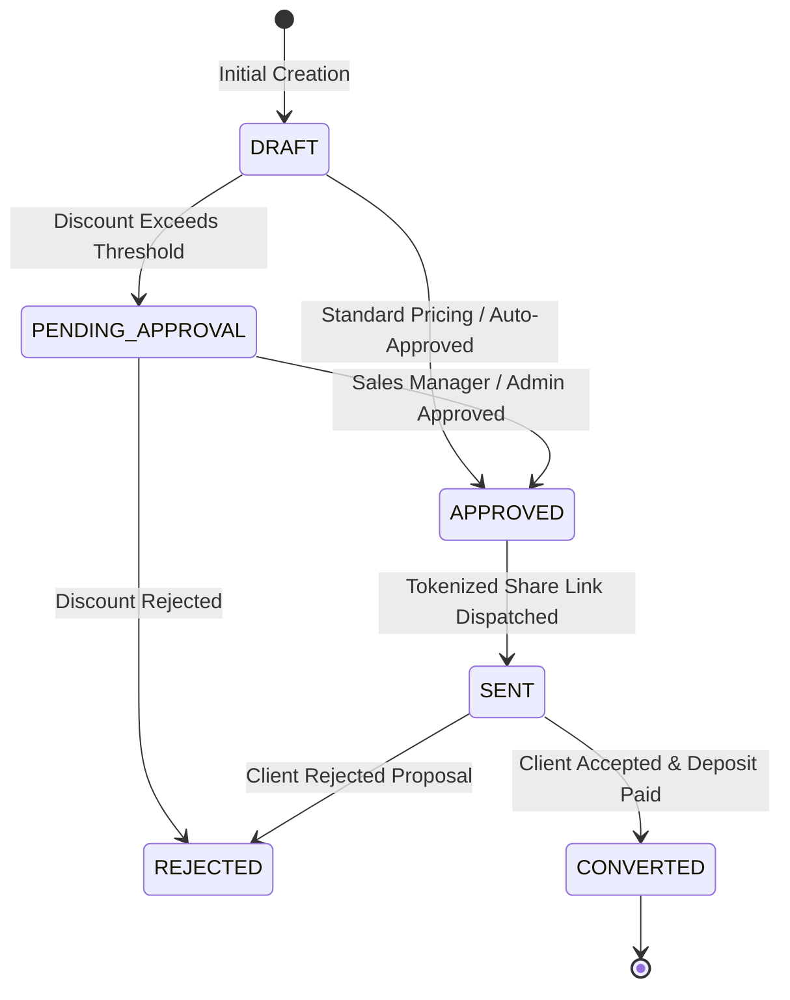

# Quotation Status Lifecycle & State Machine

## Overview

Veloria Grand maintains two quotation status enums in Prisma: `SalesQuotationStatus` for internal sales workflow and `QuoteStatus` for secondary line-item quotes.

---

## State Transition Map (`SalesQuotationStatus`)

---

## Status Definitions

- `DRAFT`: Initial quote under construction.
- `PENDING_APPROVAL`: Requires `SALES_HEAD` or `ADMIN` approval due to high discounts.
- `APPROVED`: Pricing finalized and ready to send.
- `SENT`: Tokenized public share link active (`/q/[token]`).
- `REJECTED`: Proposal rejected by manager or client.
- `CONVERTED`: Terminal "won" state; booking confirmed and deposit invoice generated.
