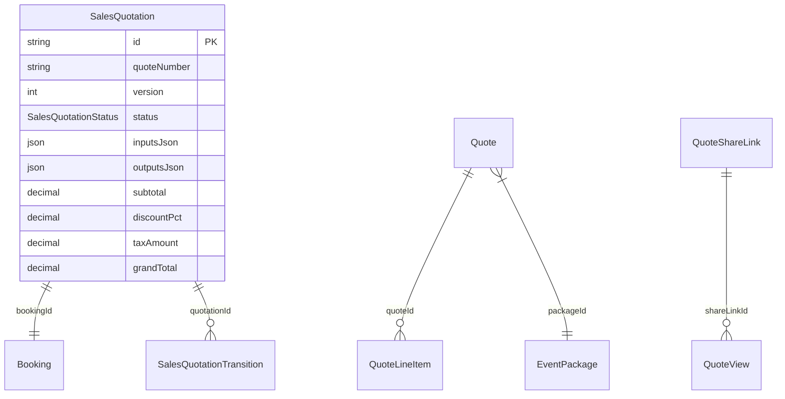

# Quotation Database Schema & Entity Relationships

## Overview

Comprehensive reference for quotation and pricing models in Prisma.

---

## Schema Entity Diagram

```mermaid
erDiagram
    SalesQuotation ||--|| Booking : "bookingId"
    SalesQuotation ||--o{ SalesQuotationTransition : "quotationId"
    Quote ||--o{ QuoteLineItem : "quoteId"
    Quote }|--|| EventPackage : "packageId"
    QuoteShareLink ||--o{ QuoteView : "shareLinkId"

    SalesQuotation {
        string id PK
        string quoteNumber
        int version
        SalesQuotationStatus status
        json inputsJson
        json outputsJson
        decimal subtotal
        decimal discountPct
        decimal taxAmount
        decimal grandTotal
    }
```
