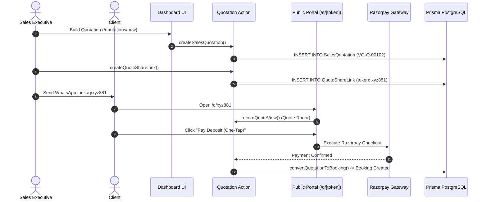

# Quotation End-to-End User Journeys

## Overview

Sequence diagrams illustrating end-to-end user navigation and execution flows.

---

## Journey 1: Proposal Creation to One-Tap Booking Deposit

```mermaid
sequenceDiagram
    autonumber
    actor Sales as Sales Executive
    actor Client as Client
    participant App as Dashboard UI
    participant Action as Quotation Action
    participant Public as Public Portal (/q/[token])
    participant Pay as Razorpay Gateway
    participant DB as Prisma PostgreSQL

    Sales->>App: Build Quotation (/quotations/new)
    App->>Action: createSalesQuotation()
    Action->>DB: INSERT INTO SalesQuotation (VG-Q-00102)
    Sales->>Action: createQuoteShareLink()
    Action->>DB: INSERT INTO QuoteShareLink (token: xyz881)
    Sales->>Client: Send WhatsApp Link /q/xyz881
    Client->>Public: Open /q/xyz881
    Public->>Action: recordQuoteView() (Quote Radar)
    Client->>Public: Click "Pay Deposit (One-Tap)"
    Public->>Pay: Execute Razorpay Checkout
    Pay-->>Action: Payment Confirmed
    Action->>DB: convertQuotationToBooking() -> Booking Created
```
