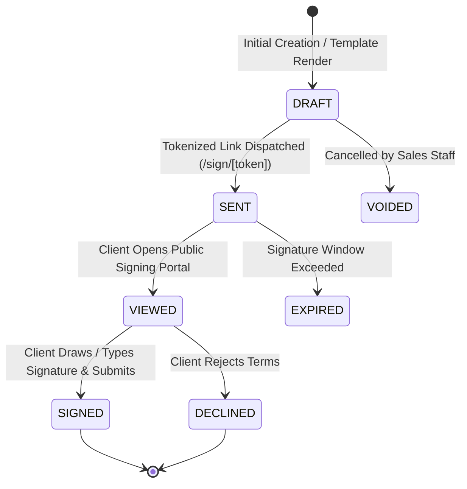

# Contract Status Lifecycle & State Machine

## Overview

Veloria Grand maintains two primary contract status state machines in Prisma: `ContractStatus` for client agreements and `SignatureRequestStatus` for tokenized digital signature requests.

---

## State Transition Map (`SignatureRequestStatus`)

---

## Status Definitions

- `DRAFT`: Contract drafted, awaiting review or dispatch.
- `SENT`: Tokenized public link delivered to client.
- `VIEWED`: Client opened proposal link (`viewedAt` logged).
- `SIGNED`: Digitally signed; document locked (`isLocked = true`).
- `DECLINED`: Client rejected terms (`declinedReason` recorded).
- `EXPIRED` / `VOIDED`: Expired or invalidated.
