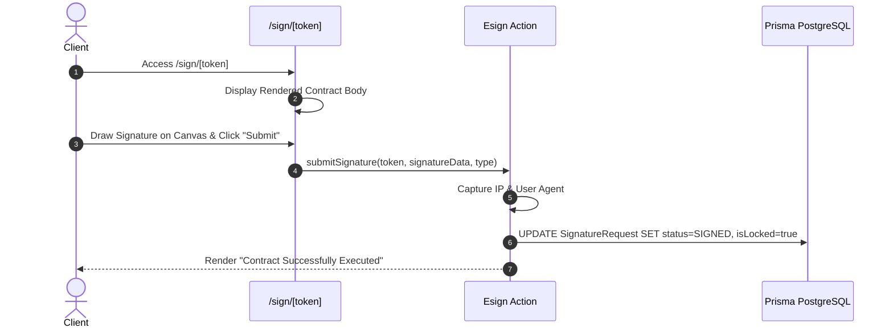

# Signature Execution Workflow

## Overview

Step-by-step execution flow for remote digital contract signing.

---

## Step-by-Step Flow

```mermaid
sequenceDiagram
    autonumber
    actor Client
    participant Portal as /sign/[token]
    participant Action as Esign Action
    participant DB as Prisma PostgreSQL

    Client->>Portal: Access /sign/[token]
    Portal->>Portal: Display Rendered Contract Body
    Client->>Portal: Draw Signature on Canvas & Click "Submit"
    Portal->>Action: submitSignature(token, signatureData, type)
    Action->>Action: Capture IP & User Agent
    Action->>DB: UPDATE SignatureRequest SET status=SIGNED, isLocked=true
    Action-->>Client: Render "Contract Successfully Executed"
```
