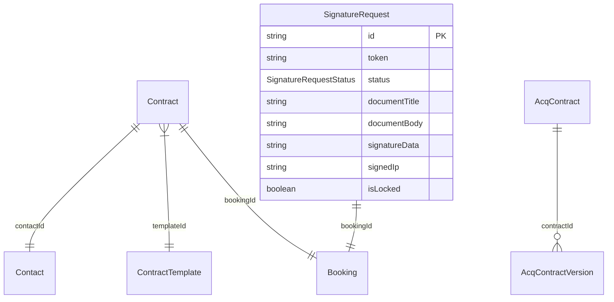

# Contract Database Schema & Entity Relationships

## Overview

Comprehensive reference for contract, template, and signature models in Prisma.

---

## Entity Diagram

```mermaid
erDiagram
    Contract ||--|| Contact : "contactId"
    Contract }|--|| ContractTemplate : "templateId"
    Contract ||--|| Booking : "bookingId"
    SignatureRequest ||--|| Booking : "bookingId"
    AcqContract ||--o{ AcqContractVersion : "contractId"

    SignatureRequest {
        string id PK
        string token
        SignatureRequestStatus status
        string documentTitle
        string documentBody
        string signatureData
        string signedIp
        boolean isLocked
    }
```
