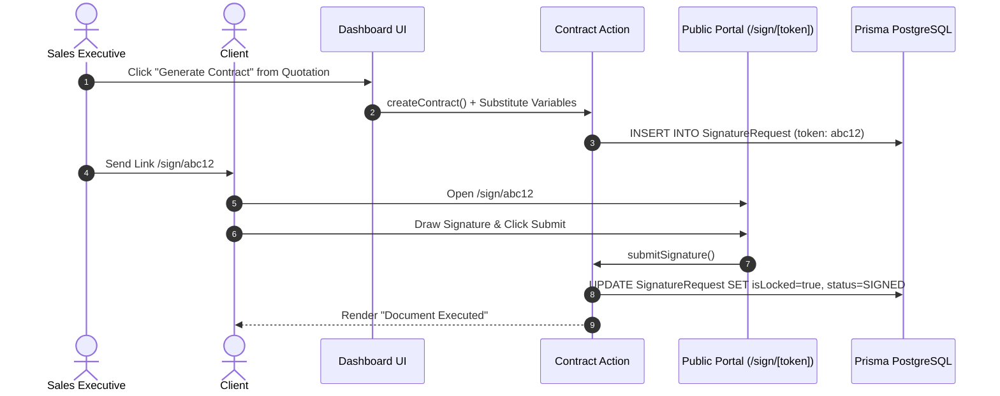

# Contract End-to-End User Journeys

## Overview

Sequence diagrams illustrating end-to-end user navigation and execution flows for digital contract workflows.

---

## Journey 1: Contract Template Render to Public E-Sign Execution

