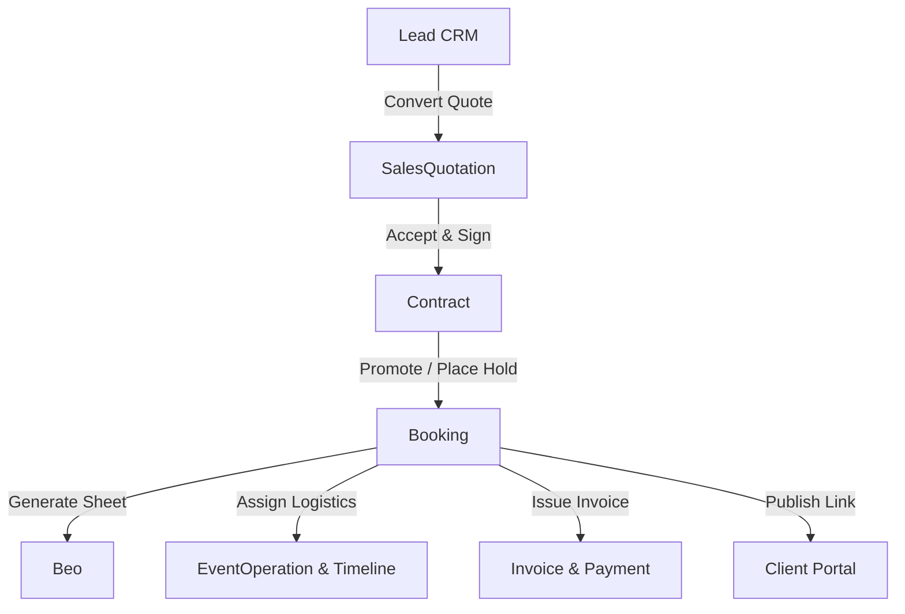

# 01 - Booking & Event Management Overview

---

## 📌 Module Summary
The **Booking & Event Management Module** in Veloria Grand serves as the operational and commercial bridge connecting sales acquisition (`Lead` -> `SalesQuotation` -> `Contract`) to event execution (`Beo`, `EventOperation`, `EventTimeline`) and financial fulfillment (`Invoice`, `Payment`).

- **CODE VERIFIED**: Core server actions are defined in `src/actions/booking.actions.ts`, `src/actions/quotation-booking.actions.ts`, and `src/actions/beo.actions.ts`.
- **SCHEMA VERIFIED**: `Booking`, `Beo`, `BeoIncident`, `EventDayTimeline`, `Venue`, `PublicHold` Prisma models in `prisma/schema.prisma`.
- **ROUTES VERIFIED**: `/bookings`, `/bookings/[bookingId]`, `/bookings/[bookingId]/control`, `/beo`, `/portal/bookings`, `/public/hold`.

---

## 👥 Primary User Roles & Stakeholders
1. **Sales Executive / Sales Head**: Converts quotes/contracts into bookings, manages deposit holds, and tracks commercial terms.
2. **Event Coordinator / Operations Head**: Configures event timelines (`EventDayTimeline`), generates BEO function sheets (`Beo`), manages tastings, and handles day-of control (`/bookings/[bookingId]/control`).
3. **Finance Manager / Cashier**: Generates deposit invoices (`createBookingInvoiceFromQuotation`), tracks balance payments, and issues receipts.
4. **Client / Event Host**: Views booking details, menus, seating charts, and guest RSVPs via Client Portal (`/portal/bookings/[bookingId]`).

---

## 🔑 Key Core Architecture Concepts
- **Hold vs Confirmed Status**: Initial bookings enter `HOLD` status with a `holdExpiresAt` timestamp. Promotion to `CONFIRMED` occurs upon contract signing, deposit payment, or manual admin override (`confirmBooking`).
- **Venue & TimeSlot Locking**: Bookings require `venueId`, `date`, and `timeSlot` (`MORNING`, `EVENING`, `FULL_DAY`), enforcing composite uniqueness `@index([venueId, date, timeSlot])` to prevent double-booking.
- **BEO Linkage**: One `Booking` links to one primary `Beo` record (`beoNumber`), containing run-of-show details, headcount source tracking (`CONTRACTED`, `RSVP_CONFIRMED`, `MANUAL`), and incident logs.
