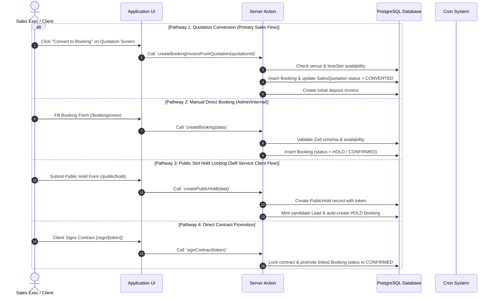

# 04 - Booking Creation Pathways

---

## 📌 Supported Creation Pathways

Veloria Grand supports 4 distinct pathways for creating a `Booking` record:

---

## 📋 Field Copying & Invariant Rules
When converted from a `SalesQuotation`:
- `eventName` <- `SalesQuotation.eventName`
- `eventType` <- `SalesQuotation.eventType`
- `guestCount` <- `SalesQuotation.guestCount`
- `date` <- `SalesQuotation.eventDate`
- `timeSlot` <- `SalesQuotation.timeSlot`
- `venueId` <- `SalesQuotation.venueId`
- `totalAmount` <- `SalesQuotation.totalAmount`
- `perPlatePrice` <- `SalesQuotation.perPlatePrice`
- `contactId` <- `SalesQuotation.lead.contactId`
- `bookingNumber` <- Generated via `generateBookingNumber()` (e.g. `VG-BK-2026-0042`)
