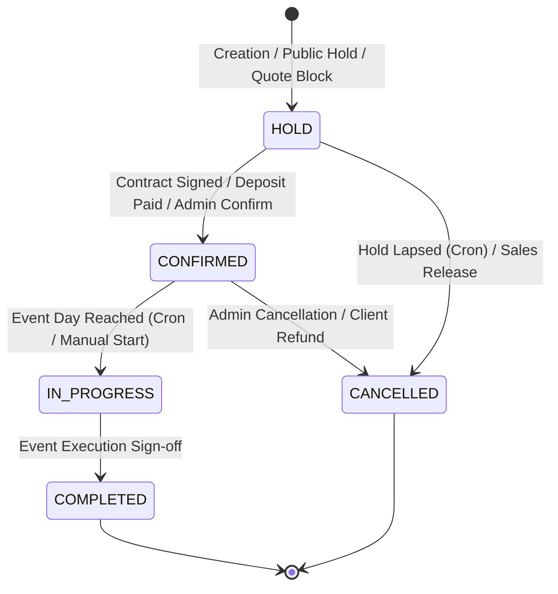

# 06 - Booking Status Lifecycle & State Machine

---

## 🔄 Booking Status Enum (`BookingStatus`)

---

## 📊 Status Transition Matrix

| Current State | Target State | Triggering Mechanism | Validation Rules | Side Effects | Reversible? |
|---|---|---|---|---|---|
| `HOLD` | `CONFIRMED` | `confirmBooking()` or deposit payment | Deposit payment recorded OR e-signed contract linked | Locks timeSlot permanently, notifies ops | No |
| `HOLD` | `CANCELLED` | `releaseHold()` or `/api/cron/hold-expiry` | `holdExpiresAt < NOW()` | Releases timeSlot for availability grid | No |
| `CONFIRMED` | `IN_PROGRESS` | `/api/cron/event-lifecycle` or manual start | `date == TODAY()` | Triggers event day briefing cron notifications | No |
| `IN_PROGRESS` | `COMPLETED` | `completeBooking()` or event sign-off action | Operations checklist complete | Enqueues automated review request (`ReviewRequest`) | No |
| `CONFIRMED` | `CANCELLED` | `cancelBooking(reason)` | Must provide mandatory cancellation reason text | Triggers refund evaluation and vendor notification | No |
