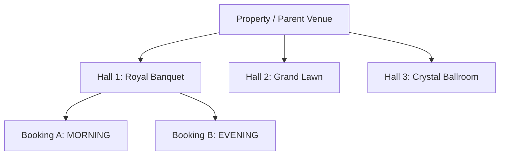

# 09 - Client & Venue Association

---

## 🏢 Venue & Property Hierarchy Architecture

- **Venue Entity (`Venue`)**: Represents a physical property or sub-hall (capacity, base price per slot, amenities, property type).
- **Sub-Hall Assignment (`Booking.hallBooked`)**: Stores the specific hall/section name within the venue (e.g., "Grand Ballroom Section A").
- **Client Linkage (`Contact` / `Client`)**: Linked via `Booking.contactId`. Captures primary host contact details, phone, email, and billing address.
