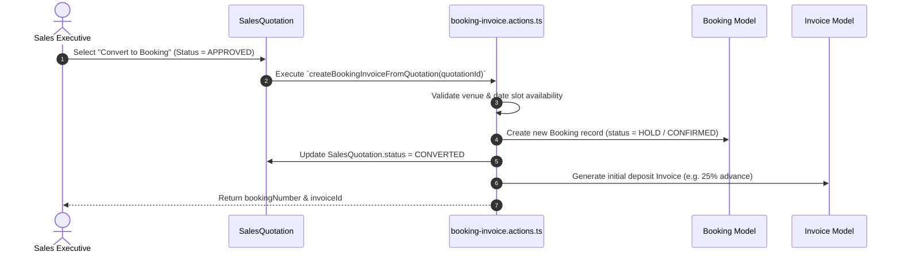

# 15 - Quotation to Booking Conversion Workflow

---

## 🔄 Quotation Conversion Engine

- **File Reference**: `src/actions/booking-invoice.actions.ts`
- **Data Preserved**: All custom menu selections, add-ons, pricing tiers, client contact IDs, and venue assignments are copied seamlessly without data loss.
