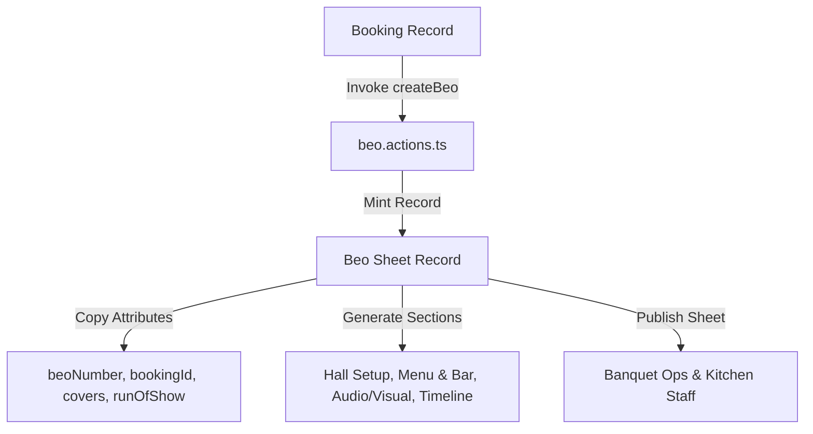

# 20 - Booking to BEO Handoff Workflow

---

## 📄 Banquet Event Order (BEO) Creation Engine

- **Server Action**: `createBeo(bookingId)` in `src/actions/beo.actions.ts`.
- **Headcount Synchronization**: Reads `covers` from `Booking.guestCount` and sets `coversSource = 'CONTRACTED'`.
- **Run of Show Setup**: Initializes standard banquet timeline JSON structure (`runOfShow`) for operational execution.
