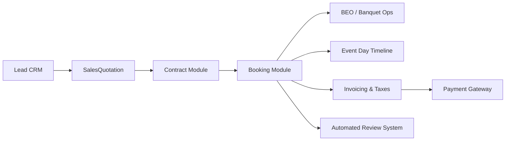

# 35 - Booking Feature Dependency Map

---

## 🔄 Upstream & Downstream Dependencies

- **Upstream Modules**: `Lead`, `SalesQuotation`, `Contract`, `Venue`.
- **Downstream Modules**: `BEO`, `EventOperation`, `Invoice`, `Payment`, `Client Portal`, `Review`.
