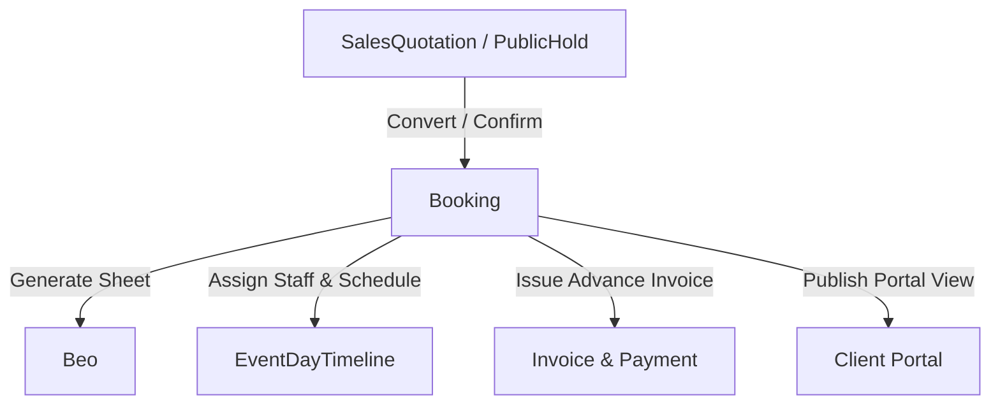

# Module 08: Booking & Event Management

---

## 📌 Module Executive Summary
The **Booking & Event Management Module** (`knowledge-base/08-booking-event-management/`) documents the complete operational, commercial, and technical lifecycle of events booked across Veloria Grand properties.

---

## 🗂️ Documentation Map

| File | Subject |
|---|---|
| `01-booking-module-overview.md` | Overview, architecture, primary stakeholders |
| `02-booking-business-purpose.md` | Operational purpose & cross-module dependencies |
| `03-booking-route-and-navigation-map.md` | Exhaustive route census (22 routes mapped) |
| `04-booking-creation.md` | 4 creation pathways & field copy invariants |
| `05-booking-detail-and-editor.md` | UI layout, tabs, and action button map |
| `06-booking-status-lifecycle.md` | Status state machine (`HOLD` -> `CONFIRMED` -> `COMPLETED`) |
| `07-booking-identifiers-and-numbering.md` | `VG-BK-YYYY-SEQ` & `BEO-YYYY-SEQ` generation engines |
| `08-event-details-and-event-configuration.md` | Event types, time slots, special requests |
| `09-client-and-venue-association.md` | Venue & sub-hall hierarchy and client linkage |
| `10-event-date-time-and-scheduling.md` | Composite index availability guard & blackout dates |
| `11-guest-count-and-capacity.md` | Guest headcount tracking & capacity guards |
| `12-packages-menus-and-event-items.md` | Booking menus, food tasting sessions, add-ons |
| `13-booking-pricing-and-commercials.md` | Commercial structure & tax breakdown |
| `14-booking-contract-relationship.md` | Legal contract linkage & promotion rules |
| `15-quotation-to-booking.md` | Quote conversion & advance invoice creation |
| `16-contract-to-booking.md` | Contract signing & booking status locking |
| `17-booking-amendments-and-changes.md` | Date/slot rescheduling & audit logging |
| `18-booking-cancellation.md` | Cancellation workflow & hold expiry crons |
| `19-booking-confirmation.md` | 3 confirmation pathways & deposit capture |
| `20-booking-to-beo.md` | BEO function sheet creation & headcount source tagging |
| `21-booking-to-operations.md` | Operational readiness checks & day-of control board |
| `22-booking-to-invoicing.md` | Milestone invoicing & GST tax calculation |
| `23-booking-to-payments.md` | Razorpay gateway settlement & general ledger posting |
| `24-booking-client-portal.md` | Client self-service portal, RSVP tracker, seating builder |
| `25-booking-notifications.md` | System notification triggers & payload specs |
| `26-booking-email-and-whatsapp.md` | Resend email & Meta WhatsApp Cloud API templates |
| `27-booking-automation-and-crons.md` | Cron job census (6 active automated crons) |
| `28-booking-permissions-and-role-access.md` | Fine-grained RBAC matrix across 8 roles |
| `29-booking-database-model.md` | Prisma model mapping (`Booking`, `Beo`, `PublicHold`, `Venue`) |
| `30-booking-server-actions-and-api.md` | Server actions & API endpoint registry |
| `31-booking-validation-and-business-rules.md` | Validation safeguards & business rules |
| `32-booking-documents-and-pdf.md` | BEO function sheet PDFs & cloud storage |
| `33-booking-integrations.md` | 6 internal & external system integrations |
| `34-booking-end-to-end-user-journeys.md` | 3 complete end-to-end user journeys |
| `35-booking-feature-dependency-map.md` | Upstream & downstream feature dependency graph |
| `36-booking-brief-vs-code-traceability.md` | Brief vs code verification matrix |
| `37-booking-gaps-and-verification.md` | Implemented, partial, and missing feature report |
| `38-complete-booking-feature-index.md` | Granular feature catalog (BOOKING-001 to BOOKING-018) |

---

## 📊 Quick Technical Stats
- **Page Routes Discovered**: 22 App Routes (`/bookings`, `/bookings/[bookingId]`, `/beo`, `/public/hold`, etc.)
- **API Cron Routes Discovered**: 9 API Endpoints (`/api/cron/hold-expiry`, `/api/cron/event-lifecycle`, `/api/cron/event-briefings`, etc.)
- **Server Actions**: 20+ Server Actions (`createBooking`, `confirmBooking`, `cancelBooking`, `createBeo`, `createBookingInvoiceFromQuotation`, etc.)
- **Prisma Models**: 10 Core Models (`Booking`, `Beo`, `BeoIncident`, `PublicHold`, `Venue`, `Tasting`, `EventDayTimeline`, `BlackoutDate`, `SeatingChart`, `GuestList`)
- **Enums**: `BookingStatus`, `BeoStatus`, `TimeSlot`, `PublicHoldStatus`, `TastingStatus`
