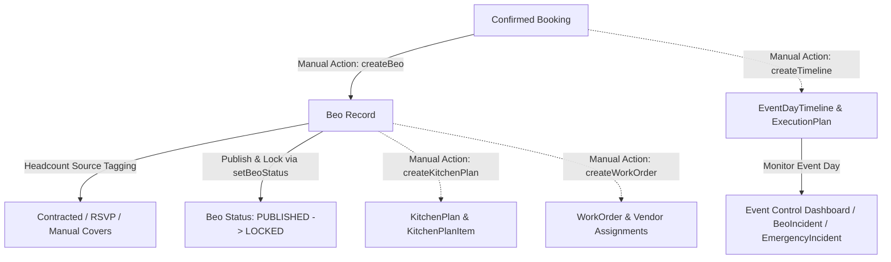

# 01 - BEO & Operations Overview

---

## 📌 Module Summary
The **BEO & Operations Module** in Veloria Grand turns confirmed event bookings (`Booking.status == CONFIRMED`) into executable operational plans, kitchen prep orders, vendor work orders, staff shifts, run-of-show timelines, and event-day execution controls.

- **CODE VERIFIED**: Server actions in `src/actions/beo.actions.ts`, `src/actions/ops-readiness.actions.ts`, `src/actions/execution-task.actions.ts`, `src/actions/kitchen.actions.ts`, `src/actions/event-day.actions.ts`, `src/actions/emergency.actions.ts`.
- **SCHEMA VERIFIED**: `Beo`, `BeoIncident`, `KitchenPlan`, `EventOperation`, `EventDayTimeline`, `ExecutionPlan`, `WorkOrder`, `SeatingChart`, `Tasting`, `EmergencyIncident`.
- **ROUTES VERIFIED**: `/beo`, `/beo/[id]`, `/kitchen`, `/kitchen/[id]`, `/bookings/[bookingId]/control`, `/bookings/[bookingId]/day-of`, `/tasks`, `/vendors`, `/vendor-portal/events`.

---

## 👥 Primary User Roles & Stakeholders
1. **Banquet Operations Head / Operations Manager**: Oversees venue readiness (`getOperationReadiness`), publishes BEO sheets (`setBeoStatus`), locks operational specifications, and resolves active incidents (`resolveBeoIncident`).
2. **Event Coordinator / Day-Of Lead**: Manages real-time run-of-show timelines (`EventDayTimeline`), tracks SLA tasks (`ExecutionTask`), and coordinates vendor arrivals via Event Control (`/bookings/[bookingId]/control`).
3. **Head Chef / Kitchen Manager**: Consumes kitchen plans (`KitchenPlan`), tracks contracted vs RSVP headcount, calculates estimated food costs (`estFoodCost`), and orders raw prep inventory.
4. **Vendor / External Contractor**: Accepts work orders (`WorkOrder`), submits bids (`VendorBid`), and confirms arrival/teardown schedules via Vendor Portal (`/vendor-portal/events`).

---

## 🔑 Key Architecture Concepts
- **BEO Status Machine**: BEO function sheets progress through `DRAFT` -> `PUBLISHED` -> `LOCKED`. Locking freezes banquet operational specifications and blocks all `updateBeo` edits.
- **Explicit Headcount Tagging**: Headcount on BEO function sheets strictly tags its source (`coversSource`: `CONTRACTED`, `RSVP_CONFIRMED`, `MANUAL`) via `src/lib/guests/headcount.ts` to prevent false precision.
- **7-Dimension Readiness Engine**: `computeOperationReadiness()` evaluates 3 mandatory gates (BEO published/locked, mandatory tasks done, vendors confirmed) and 4 optional gates (kitchen, procurement, dispatches, staff).
