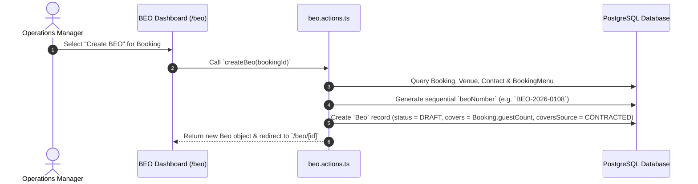

# 04 - BEO Creation Pathways

---

## 📌 BEO Creation Flow (`createBeo`)

BEO function sheets are instantiated directly from a confirmed `Booking`:

---

## 📋 Field Inheritance Rules
- `beoNumber`: Generated via sequential format `BEO-{YYYY}-{SEQ}`.
- `bookingId`: Direct foreign key link to originating `Booking`.
- `status`: Default initial state `DRAFT`.
- `covers`: Initialized from `Booking.guestCount`.
- `coversSource`: Default `CONTRACTED`.
- `runOfShow`: Initialized with default banquet timeline JSON array.
