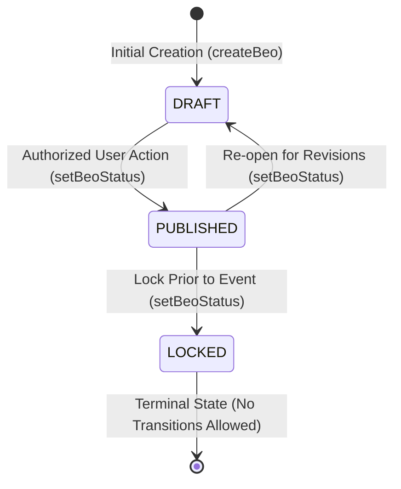

# 06 - BEO Status Lifecycle & State Machine

---

## 🔄 BEO Status State Machine (`src/lib/ops/state-machine.ts`)

---

## 📊 BEO Status Specification

| Status | Editability | Distribution Target | Transition Authorization & Rules |
|---|---|---|---|
| `DRAFT` | Fully Editable via `updateBeo` | Internal Ops Team Only | Initial state on `createBeo()`. Allowed transition: `PUBLISHED`. |
| `PUBLISHED` | Editable via `updateBeo` | Banquet Ops, Kitchen, Vendors | Authorized via `canWrite(role)` permission check (`beo:create`, `beo:edit`, or `beo:manage`). Allowed transitions: `LOCKED`, `DRAFT`. Stamps `publishedAt`. |
| `LOCKED` | **READ-ONLY** (`updateBeo` returns Error) | Final Execution Printout | Authorized via `canWrite(role)`. Terminal state in `OPS_TRANSITIONS.beo` (`LOCKED: []`). Unlocking via `setBeoStatus` is blocked by state machine rules. |

*Note: 24-48h prior to event timing is an operational guidelines recommendation and is not an application-enforced code rule.*
