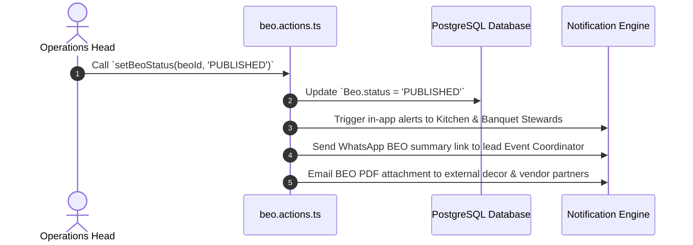

# 14 - BEO Publishing & Distribution Workflow

---

## 📢 Publishing Mechanics (`setBeoStatus('PUBLISHED')`)

- **File Reference**: `src/actions/beo.actions.ts`
- **Visibility Effect**: Published BEOs become visible on kitchen prep dashboards (`/kitchen`) and vendor portals (`/vendor-portal/events`).
