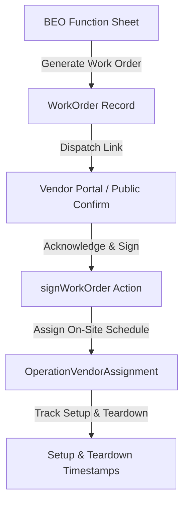

# 22 - Vendor Event Execution & Work Orders

---

## 🤝 Vendor Execution Workflow (`WorkOrder` & `VendorBid`)

- **Server Actions**: `src/actions/work-order.actions.ts` (`createWorkOrder`, `sendWorkOrder`, `signWorkOrder`).
- **Timing Trackers**: `OperationVendorAssignment` logs `arrivalTime`, `setupTime`, and `teardownTime` for on-site vendor compliance.
