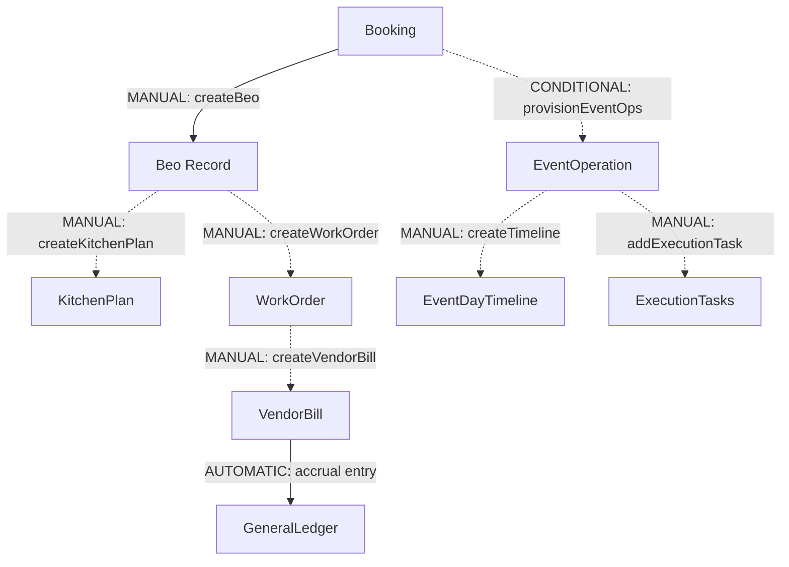

# 39 - BEO & Operations Feature Dependency Map

---

## 🔄 Explicit Dependency Classification Graph

- **AUTOMATIC**: `VendorBill -> GeneralLedger` (Accrual entry generated upon bill approval).
- **MANUAL**: `Booking -> Beo`, `Beo -> KitchenPlan`, `Beo -> WorkOrder`, `EventOp -> Timeline`, `EventOp -> Tasks`, `WorkOrder -> VendorBill`.
- **CONDITIONAL**: `Booking -> EventOperation`.
