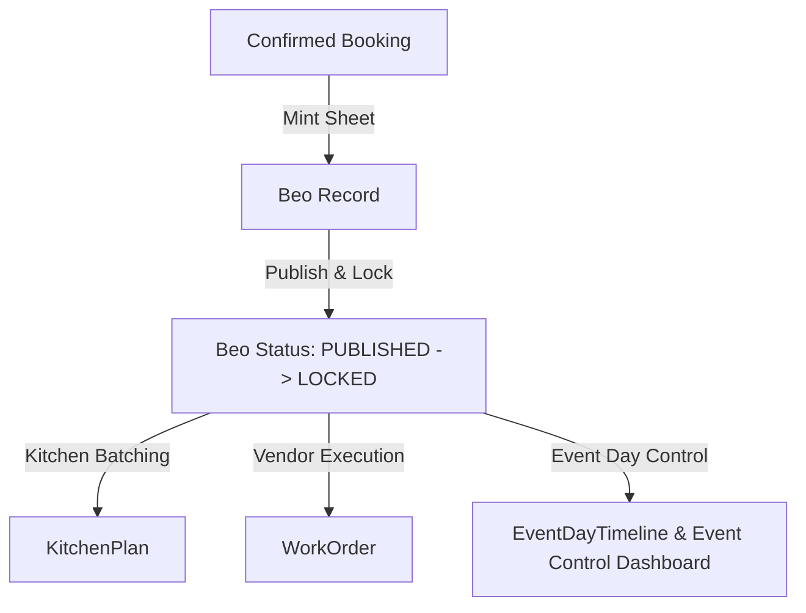

# Module 09: BEO & Operations

---

## 📌 Module Executive Summary
The **BEO & Operations Module** (`knowledge-base/09-beo-operations/`) documents how confirmed event bookings (`Booking`) transition into executable banquet operations, BEO function sheets, kitchen batch plans, vendor work orders, run-of-show timelines, and event-day execution controls.

---

## 🗂️ Documentation Map

| File | Subject |
|---|---|
| `01-beo-operations-overview.md` | Overview, architecture, primary stakeholders |
| `02-beo-business-purpose.md` | Operational business goals & cross-module dependencies |
| `03-beo-route-and-navigation-map.md` | Exhaustive route census (12 operations routes mapped) |
| `04-beo-creation.md` | BEO creation pathways & field inheritance rules |
| `05-beo-detail-and-editor.md` | BEO editor UI layout, tabs, and interactive controls |
| `06-beo-status-lifecycle.md` | BEO state machine (`DRAFT` -> `PUBLISHED` -> `LOCKED`) |
| `07-beo-versioning-and-locking.md` | Locking mechanics & admin override rules |
| `08-beo-data-from-booking.md` | Data transfer mapping from Booking to BEO |
| `09-beo-headcount-management.md` | Headcount source tagging (`CONTRACTED`, `RSVP_CONFIRMED`, `MANUAL`) |
| `10-beo-event-details.md` | Event parameters, time slots, host details |
| `11-beo-venue-and-space-details.md` | Hall partitions, seating layouts, AV & AC requirements |
| `12-beo-menu-package-and-service-details.md` | Catering styles, menu badges, bar service terms |
| `13-beo-special-requirements-and-notes.md` | Dietary notes, VIP protocols, vendor setup deadlines |
| `14-beo-publishing-and-distribution.md` | BEO publishing workflow & alert dispatches |
| `15-beo-pdf-and-document-generation.md` | React PDF rendering & S3 document storage |
| `16-operational-readiness.md` | Readiness score computation & watchdog cron |
| `17-event-day-control.md` | Real-time event control dashboard (`/bookings/[id]/day-of`) |
| `18-run-of-show-and-event-timeline.md` | Run-of-show timeline & Drag-and-Drop ordering |
| `19-operational-task-management.md` | Execution tasks, SLA tracking, proof uploads |
| `20-operational-task-assignment.md` | Staff shift allocations (`Shift`) & check-in logs |
| `21-event-incidents.md` | BEO incident logging (`BeoIncident`) & emergency protocols |
| `22-vendor-event-execution.md` | Work orders (`WorkOrder`) & on-site timing trackers |
| `23-guest-rsvp-and-operations.md` | Guest RSVP impact on BEO covers and kitchen prep |
| `24-seating-and-operations.md` | Interactive seating chart builder & floorplan PDF |
| `25-food-tasting-and-operations.md` | Menu tasting sessions & chef feedback recording |
| `26-kitchen-and-service-operations.md` | Kitchen batch plans (`KitchenPlan`) & food cost tracking |
| `27-booking-to-beo.md` | Booking-to-BEO handoff workflow |
| `28-beo-to-operations.md` | BEO-to-operations distribution to kitchen & vendors |
| `29-operations-to-finance.md` | Vendor bill accruals & post-event financial settlement |
| `30-operations-notifications.md` | In-app & push alert engine specifications |
| `31-operations-email-and-whatsapp.md` | Resend email & Meta WhatsApp Cloud API templates |
| `32-operations-automation-and-crons.md` | Automated cron job census (3 active crons) |
| `33-beo-operations-permissions-and-role-access.md` | Fine-grained RBAC matrix across 7 roles |
| `34-beo-operations-database-model.md` | Prisma model mapping (`Beo`, `KitchenPlan`, `WorkOrder`, etc.) |
| `35-beo-operations-server-actions-and-api.md` | Server actions & API endpoint registry |
| `36-beo-operations-validation-and-business-rules.md` | Validation safeguards & business rules |
| `37-beo-operations-integrations.md` | 5 internal & external system integrations |
| `38-beo-operations-end-to-end-user-journeys.md` | 2 complete end-to-end user journeys |
| `39-beo-operations-feature-dependency-map.md` | Upstream & downstream feature dependency graph |
| `40-beo-operations-brief-vs-code-traceability.md` | Brief vs code verification matrix |
| `41-beo-operations-gaps-and-verification.md` | Implemented, partial, and missing feature report |
| `42-complete-beo-operations-feature-index.md` | Granular feature catalog (OPS-BEO-001 to OPS-BEO-014) |

---

## 📊 Quick Technical Stats
- **Page Routes Discovered**: 12 App Routes (`/beo`, `/beo/[id]`, `/kitchen`, `/bookings/[id]/operations`, etc.)
- **API Cron Routes Discovered**: 3 API Endpoints (`/api/cron/readiness-watchdog`, `/api/cron/vendor-reminders`, `/api/cron/event-briefings`)
- **Server Actions**: 15+ Server Actions (`createBeo`, `setBeoStatus`, `addBeoIncident`, `getOperationReadinessForBooking`, `createKitchenPlan`, `createWorkOrder`, `signWorkOrder`, etc.)
- **Prisma Models**: 12 Core Models (`Beo`, `BeoIncident`, `KitchenPlan`, `KitchenPlanItem`, `EventOperation`, `EventDayTimeline`, `TimelineItem`, `ExecutionPlan`, `ExecutionTask`, `WorkOrder`, `SeatingChart`, `MenuTasting`)
- **Enums**: `BeoStatus`, `TaskStatus`, `TaskPriority`, `ExecutionTaskStatus`, `VendorStatus`, `OperationStatus`, `TimelineStatus`
