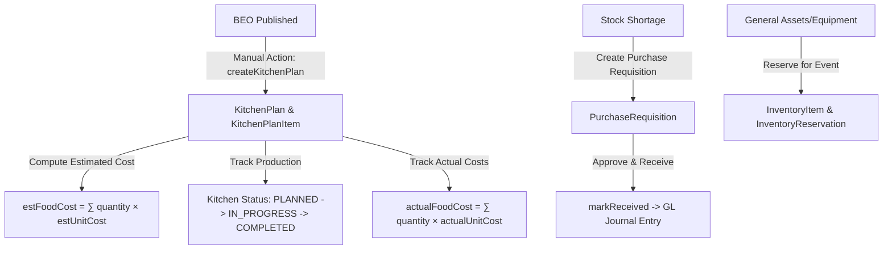

# 01 - Kitchen & Inventory Overview

---

## 📌 Module Summary
The **Kitchen & Inventory Module** in Veloria Grand bridges banquet operations (`Booking`, `Beo`) with catering batch planning, ingredient procurement, inventory reservation, and food cost accounting (`estFoodCost` vs `actualFoodCost`).

- **CODE VERIFIED**: Server actions in `src/actions/kitchen.actions.ts`, `src/actions/inventory.actions.ts`, `src/actions/procurement.actions.ts`, `src/actions/menu.actions.ts`.
- **SCHEMA VERIFIED**: `KitchenPlan`, `KitchenPlanItem`, `InventoryItem`, `InventoryReservation`, `PurchaseRequisition`, `PurchaseRequisitionItem`, `MenuItem`, `BookingMenu`.
- **ROUTES VERIFIED**: `/kitchen`, `/kitchen/[id]`, `/inventory`, `/inventory/[itemId]`, `/menu`, `/procurement`, `/procurement/[id]`.

---

## 👥 Primary User Roles & Stakeholders
1. **Head Chef / Kitchen Lead**: Creates kitchen prep plans (`createKitchenPlan`), manages ingredient batch quantities, tracks actual unit costs (`actualUnitCost`), and marks kitchen execution completed.
2. **Inventory Manager / Storekeeper**: Manages stock items (`InventoryItem`), monitors low stock alerts (`getLowStockAlerts`), processes asset reservations (`reserveForBooking`), and handles stock receiving.
3. **Procurement Lead / Buyer**: Reviews purchase requisitions (`PurchaseRequisition`), approves requests (`approvePR`), marks items ordered/received (`markReceived`), and posts GL financial journal entries.
4. **Operations Manager**: Monitors kitchen readiness as Optional Gate 4 in `computeOperationReadiness()`.

---

## 🔑 Key Module Boundaries
- **Kitchen Production**: Managed via `KitchenPlan` and `KitchenPlanItem`. Translates banquet headcount into batch prep items and tracks estimated vs actual food costs.
- **Stock & Inventory**: Managed via `InventoryItem` and `InventoryReservation`. Handles general property/event assets, available quantities, reorder thresholds, and event date holds.
- **Procurement & Goods Receipt**: Managed via `PurchaseRequisition` and `PurchaseRequisitionItem`. Handles raw ingredient ordering, approval workflows, receiving, and automatic General Ledger accrual posting via `postPurchaseReceivedWithinTx()`.
