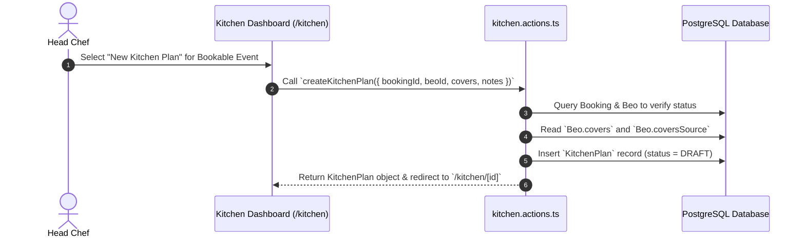

# 04 - Kitchen Plan Creation Workflow

---

## 📌 Kitchen Plan Creation (`createKitchenPlan`)

Kitchen prep plans are created manually by the Head Chef or Banquet Manager for confirmed bookings:

---

## 📋 Field Inheritance & Rules
- **`bookingId`**: Foreign key linking plan to originating `Booking`.
- **`beoId`**: Optional foreign key linking plan to `Beo` function sheet.
- **`covers`**: Inherited from `Beo.covers` or `Booking.guestCount`.
- **`coversSource`**: Inherited from `Beo.coversSource` (`CONTRACTED`, `RSVP_CONFIRMED`, `MANUAL`).
- **`status`**: Initialized to `DRAFT`.
- **`estFoodCost`**: Initialized to `0.00` until plan items are added.
