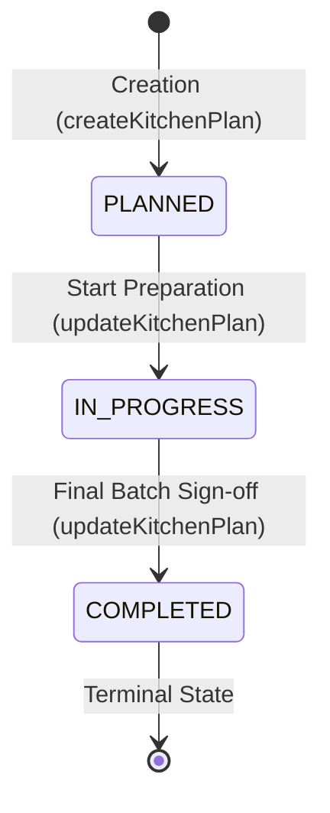

# 06 - Kitchen Plan Lifecycle & State Machine

---

## 🔄 Kitchen Status State Machine (`src/lib/ops/state-machine.ts`)

---

## 📊 Status Matrix

| Status | Code Value | Production Stage | Readiness Impact |
|---|---|---|---|
| `DRAFT` / `PLANNED` | `PLANNED` | Initial ingredient requirement sizing | Gate 4: Kitchen Not Finalised |
| `IN_PROGRESS` | `IN_PROGRESS` | Active kitchen batch cooking and prep | Gate 4: Kitchen In Progress |
| `COMPLETED` | `COMPLETED` | All dishes prepared, plated, and handed to service | Gate 4: Kitchen Plan Finalised (Ready = True) |
