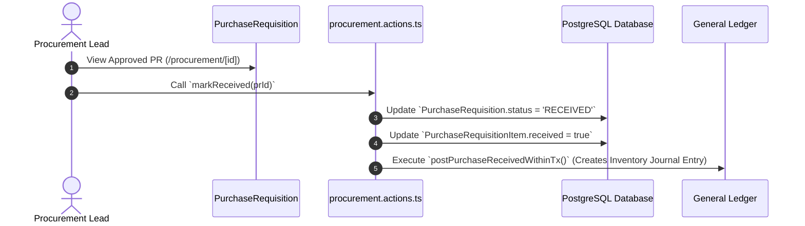

# 20 - Stock Receiving & Goods Receipt

---

## 📥 Receiving Workflow (`src/actions/procurement.actions.ts`)

Stock receiving is integrated through purchase requisitions (`PurchaseRequisition`):

```mermaid
sequenceDiagram
    autonumber
    actor Buyer as Procurement Lead
    participant PR as PurchaseRequisition
    participant Action as procurement.actions.ts
    participant DB as PostgreSQL Database
    participant GL as General Ledger

    Buyer->>PR: View Approved PR (/procurement/[id])
    Buyer->>Action: Call `markReceived(prId)`
    Action->>DB: Update `PurchaseRequisition.status = 'RECEIVED'`
    Action->>DB: Update `PurchaseRequisitionItem.received = true`
    Action->>GL: Execute `postPurchaseReceivedWithinTx()` (Creates Inventory Journal Entry)
```
