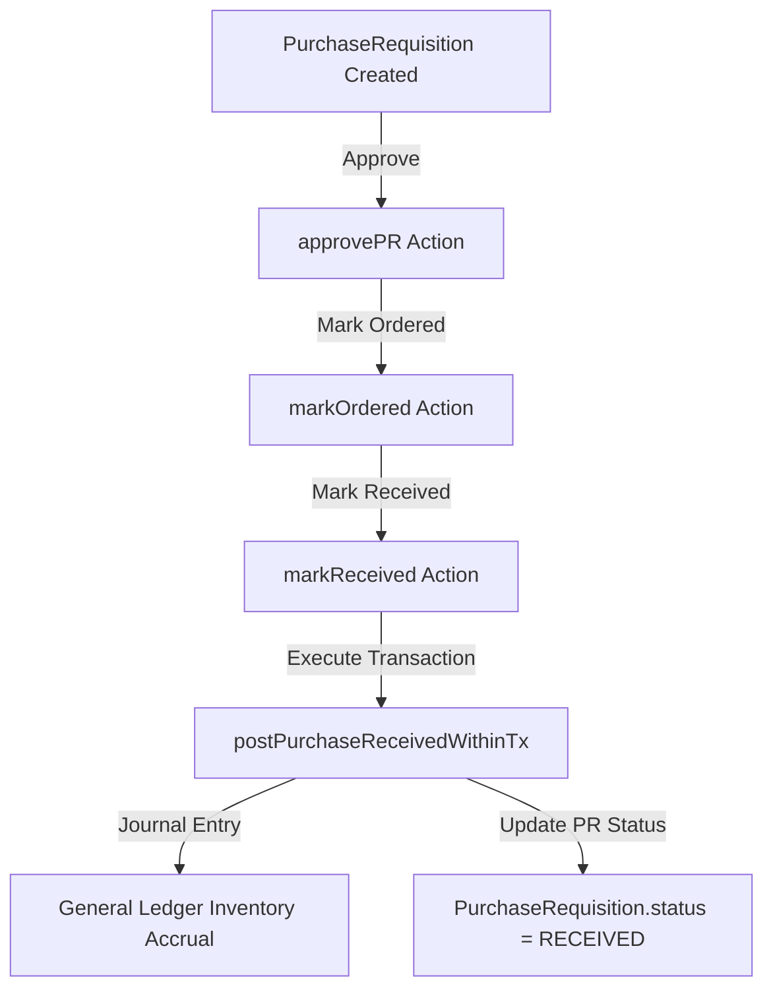

# 28 - Procurement to Inventory Integration

---

## 🔄 Procurement Handoff Workflow

```mermaid
graph TD
    PR[PurchaseRequisition Created] -->|Approve| Appr[approvePR Action]
    Appr -->|Mark Ordered| Order[markOrdered Action]
    Order -->|Mark Received| Recv[markReceived Action]
    Recv -->|Execute Transaction| Tx[postPurchaseReceivedWithinTx]
    Tx -->|Journal Entry| GL[General Ledger Inventory Accrual]
    Tx -->|Update PR Status| Status[PurchaseRequisition.status = RECEIVED]
```

- **File Reference**: `src/actions/procurement.actions.ts` and `src/lib/finance/procurement.ts`.
