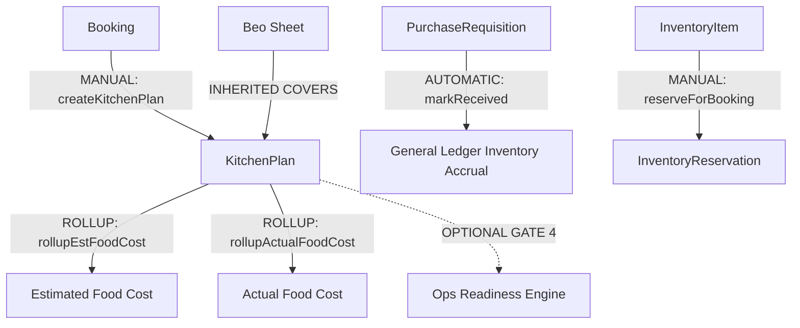

# 45 - Kitchen & Inventory Feature Dependency Map

---

## 🔄 Dependency Classification Graph

- **AUTOMATIC**: `PurchaseRequisition -> GeneralLedger` (Accrual entry generated upon `markReceived`).
- **MANUAL**: `Booking -> KitchenPlan`, `KitchenPlan -> KitchenPlanItem`, `InventoryItem -> InventoryReservation`.
- **CONDITIONAL**: `KitchenPlan -> computeOperationReadiness()` (Optional Gate 4).
