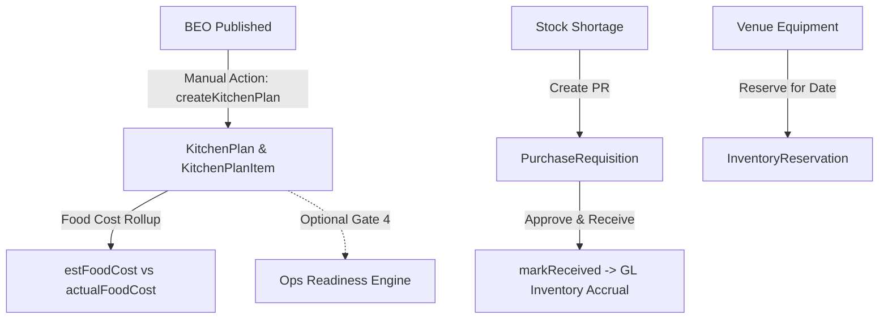

# Module 10: Kitchen Prep & Inventory

---

## 📌 Module Executive Summary
The **Kitchen Prep & Inventory Module** (`knowledge-base/10-kitchen-inventory/`) documents banquet catering batch planning, ingredient procurement, inventory asset reservations, food cost accounting (`estFoodCost` vs `actualFoodCost`), and General Ledger purchasing accrual postings.

---

## 🗂️ Documentation Map

| File | Subject |
|---|---|
| `01-kitchen-inventory-overview.md` | Overview, architecture, primary stakeholders |
| `02-kitchen-business-purpose.md` | Business goals & cross-module dependencies |
| `03-kitchen-inventory-route-and-navigation-map.md` | Route census table (11 routes mapped) |
| `04-kitchen-plan-creation.md` | Creation pathways & field inheritance rules |
| `05-kitchen-plan-detail-and-editor.md` | Kitchen plan editor UI layout, controls, and action map |
| `06-kitchen-plan-lifecycle.md` | State machine (`PLANNED` -> `IN_PROGRESS` -> `COMPLETED`) |
| `07-kitchen-plan-from-booking-and-beo.md` | Data inheritance from Booking and BEO |
| `08-headcount-and-kitchen-quantity-calculation.md` | Headcount portion rules & category buffer ratios |
| `09-menu-to-kitchen-preparation.md` | Menu item master & dietary badges |
| `10-kitchen-plan-items.md` | `KitchenPlanItem` model & Decimal rounding safety |
| `11-kitchen-batch-preparation.md` | Catering bulk batch cooking & cost reconciliation |
| `12-kitchen-production-status.md` | Production stages & readiness impact |
| `13-ingredient-management.md` | Ingredient representation in items & store stock |
| `14-recipe-management.md` | Recipe system status (Modeled in items, not separate table) |
| `15-recipe-ingredient-relationships.md` | Linkage between menu items, selections, and plan rows |
| `16-portion-and-yield-calculation.md` | Category buffer ratios (Starters +10%, Desserts 1.5-2x) |
| `17-inventory-overview.md` | Inventory subsystem architecture & date reservations |
| `18-stock-item-management.md` | Inventory CRUD & low stock alerts |
| `19-stock-levels-and-availability.md` | Available stock formula & reservation locks |
| `20-stock-receiving.md` | Stock receiving via purchase requisitions |
| `21-stock-issues-and-consumption.md` | Consumption mechanics (Asset reservation vs manual prep stock) |
| `22-stock-transfers.md` | Multi-warehouse stock location tracking |
| `23-stock-adjustments.md` | Quantity adjustments & activity logging |
| `24-stock-wastage-and-spoilage.md` | Food cost variance tracking & spoilage logs |
| `25-stock-batches-and-expiry.md` | Batch & expiry tracking status (Not found) |
| `26-fifo-fefo-and-stock-selection.md` | FIFO/FEFO status (Not implemented; uses average price) |
| `27-inventory-ledger-and-movement-history.md` | Activity log & reservation history |
| `28-procurement-to-inventory.md` | Procurement handoff to General Ledger accruals |
| `29-purchase-requisition.md` | `PurchaseRequisition` model & approval workflow |
| `30-purchase-order.md` | `ProjectPurchaseOrder` model & work package links |
| `31-goods-receipt-and-receiving.md` | Receiving workflow & GL journal entry posting |
| `32-vendor-and-kitchen-procurement.md` | Catering vendor categories & PR assignment |
| `33-kitchen-food-costing.md` | Rollup formulas for estimated and actual food costs |
| `34-estimated-vs-actual-food-cost.md` | Cost variance % & gross margin impact |
| `35-kitchen-inventory-reconciliation.md` | Post-event batch audit & asset release |
| `36-kitchen-readiness-and-operations.md` | Optional Gate 4 in `computeOperationReadiness()` |
| `37-kitchen-event-execution.md` | Event-day kitchen prep workflow |
| `38-kitchen-roles-and-permissions.md` | Granular RBAC matrix across 6 roles |
| `39-kitchen-inventory-database-model.md` | Prisma schema mapping (`KitchenPlan`, `InventoryItem`, etc.) |
| `40-kitchen-inventory-server-actions-and-api.md` | Server actions & API endpoint registry |
| `41-kitchen-inventory-validation-and-business-rules.md` | Validation safeguards & business rules |
| `42-kitchen-inventory-notifications-and-automation.md` | Low stock dashboard alerts & email triggers |
| `43-kitchen-inventory-integrations.md` | System integrations with GL, Resend, and Ops Readiness |
| `44-kitchen-inventory-end-to-end-user-journeys.md` | 2 complete end-to-end user journeys |
| `45-kitchen-inventory-feature-dependency-map.md` | Upstream & downstream feature dependency graph |
| `46-kitchen-inventory-brief-vs-code-traceability.md` | Brief vs code verification matrix |
| `47-kitchen-inventory-gaps-and-verification.md` | Implemented, partial, and missing feature report |
| `48-complete-kitchen-inventory-feature-index.md` | Verified feature catalog (KITCHEN-001 to KITCHEN-012) |

---

## 📊 Quick Technical Stats
- **Page Routes Discovered**: 11 App Routes (`/kitchen`, `/kitchen/[id]`, `/inventory`, `/procurement`, `/menu`, `/packages`, etc.)
- **Server Actions**: 12+ Server Actions (`createKitchenPlan`, `updateKitchenPlan`, `addPlanItem`, `getItems`, `createItem`, `reserveForBooking`, `approvePR`, `markReceived`, etc.)
- **Prisma Models**: 8 Core Models (`KitchenPlan`, `KitchenPlanItem`, `InventoryItem`, `InventoryReservation`, `PurchaseRequisition`, `PurchaseRequisitionItem`, `MenuItem`, `BookingMenu`)
- **Enums**: `PackageTier`, `PurchaseOrderStatus`, `VendorCategory`
