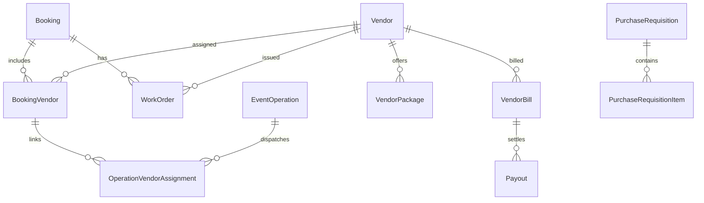

# 38 - Vendor Procurement Database Model

---

## 🗄️ Entity Relationship Diagram

```mermaid
erDiagram
    Vendor ||--o{ BookingVendor : "assigned"
    Vendor ||--o{ WorkOrder : "issued"
    Vendor ||--o{ VendorBill : "billed"
    Vendor ||--o{ VendorPackage : "offers"
    Booking ||--o{ BookingVendor : "includes"
    Booking ||--o{ WorkOrder : "has"
    EventOperation ||--o{ OperationVendorAssignment : "dispatches"
    BookingVendor ||--o{ OperationVendorAssignment : "links"
    PurchaseRequisition ||--o{ PurchaseRequisitionItem : "contains"
    VendorBill ||--o{ Payout : "settles"
```
